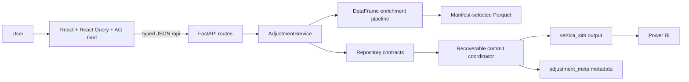
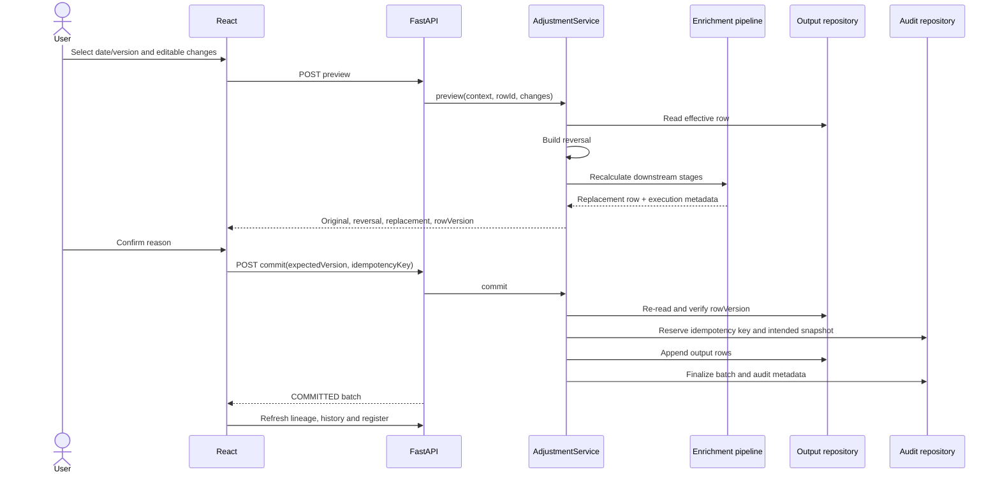

# AI agent onboarding and architecture contract

This guide gives a new contributor enough context to diagnose, modify, and
verify LiMon without rediscovering its architecture. `AGENTS.md` contains the
mandatory rules; this document explains why they exist.

## End-to-end communication



The browser chooses a snapshot and sends intent. The service creates the
authoritative output rows. Adapters persist them. React displays results but
never reproduces the accounting rules.

## Standard adjustment sequence



If output commits but metadata finalization fails, the state is
`RECONCILIATION_REQUIRED`. Retry reconciliation discovers output through the
stable adjustment reference and finalizes metadata without duplicating rows.

## Storage ownership

| Data | Owner | Mutation rule |
|---|---|---|
| Base/reversal/replacement/proxy rows | `vertica_sim` | Append-only |
| Requests and idempotency state | `adjustment_meta` | Coordinator-managed |
| Batch/snapshot/field-change history | `adjustment_meta` | Audited, never hidden |
| Field semantics | YAML data dictionary | Reviewed source of truth |
| Mapping versions | JSON manifest | Points to immutable Parquet |
| UI server state | React Query | Refetched after writes |

## How to trace a bug

1. Reproduce the HTTP request in Swagger using `docs/api-testing-guide.md`.
2. Find its route in `backend/app/main.py` and request model in `models.py`.
3. Follow the called service method and identify its invariant tests.
4. For wrong calculations, inspect dependency resolution, registry metadata,
   then the rule/parameter function and its Parquet inputs.
5. For missing rows/history, inspect the coordinator, output adapter, and audit
   adapter separately.
6. For stale UI, inspect query keys, mutation error handling, and invalidation.
7. Add a failing regression test before changing behavior when practical.

## Generated and configured sources

- Edit `backend/config/data_dictionary.yaml`, then run `make generate-fields`.
- Do not edit `frontend/src/generated/fields.ts` directly.
- Edit `backend/mapping_data/latest_mappings.json` to select mapping versions.
- Edit the registry/configuration for calculation behavior; do not select
  functions from request data or arbitrary imports.
- Environment variables and startup are documented in `.env.example` and
  `README.md`.

## Validation levels

`make check` is deterministic and does not require a live database. It runs
backend unit/contract tests, frontend tests, the production TypeScript/Vite
build, and verifies generated field metadata is current.

Database integration is separate because it mutates configured schemas:

```bash
cd backend
../.venv/bin/python scripts/verify_simulation.py
```

Run it only against an explicitly selected development database.
