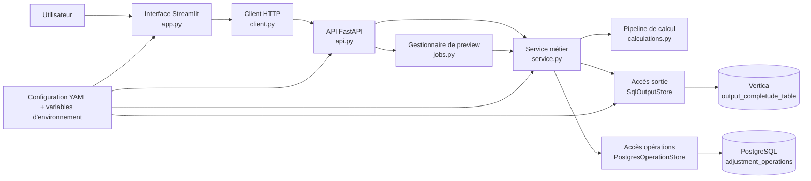
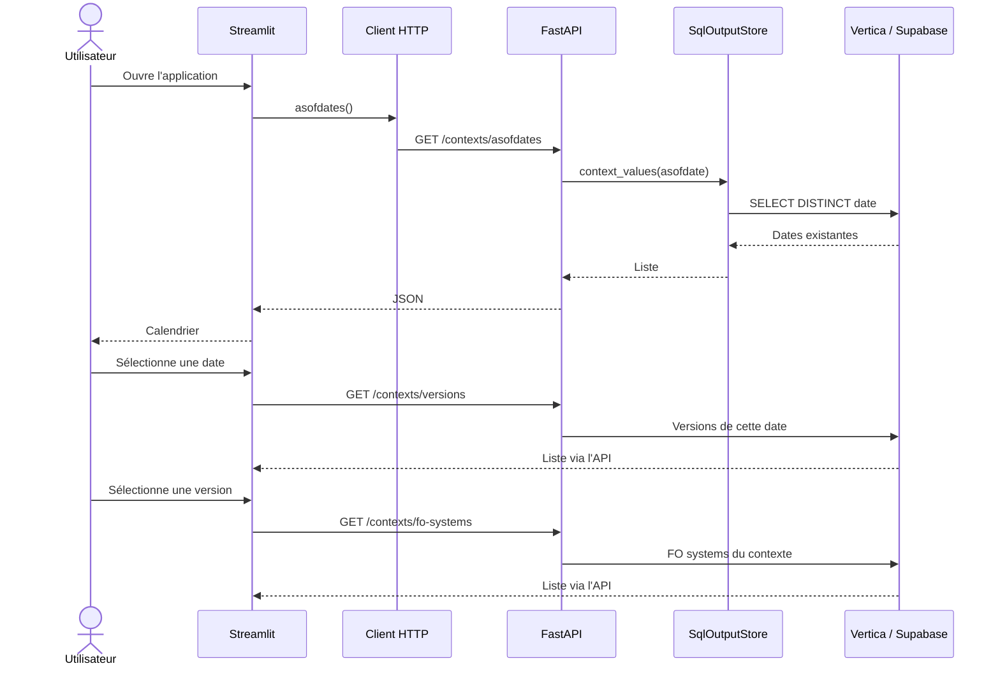
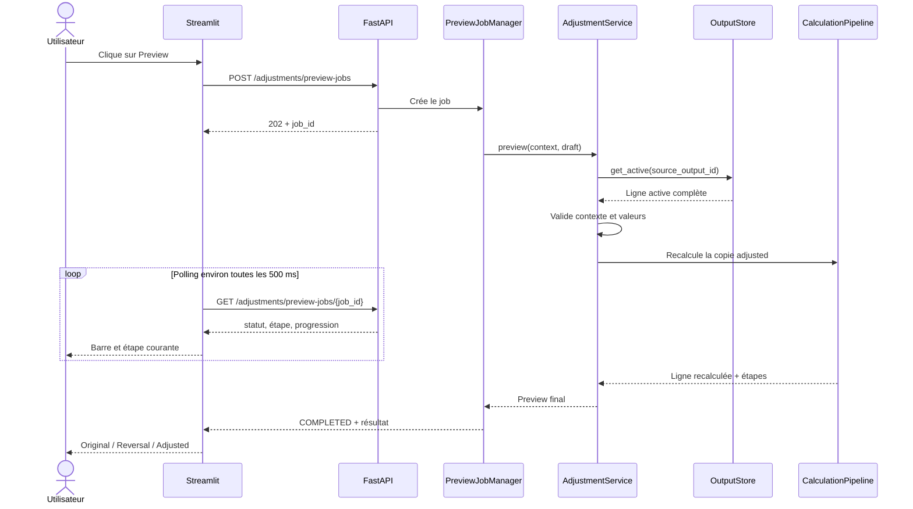
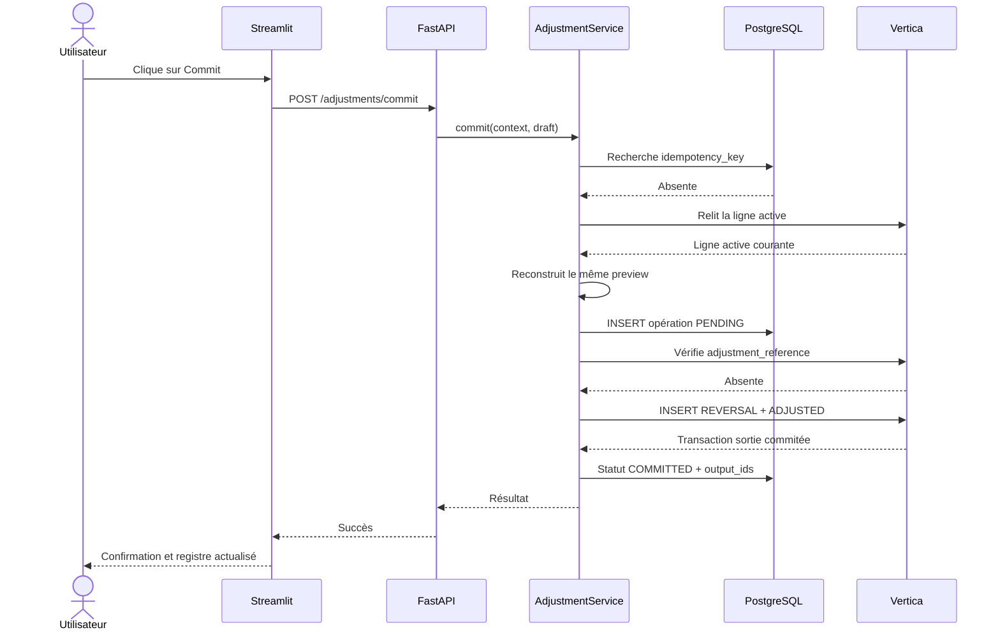
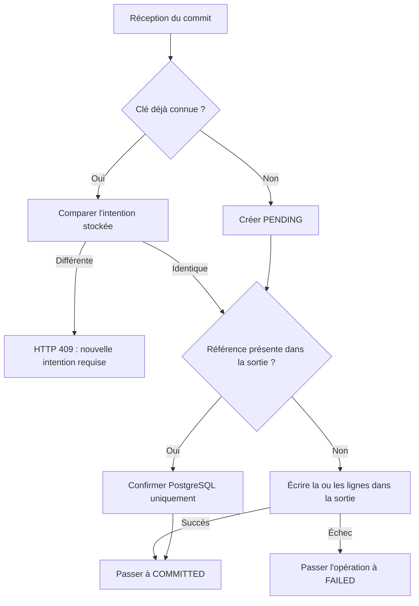

# Architecture et fonctionnement de LiMon Adjustment Manager

> **Périmètre de ce document**
> Ce document décrit l'application active et simplifiée située dans `streamlit_app/` : interface Streamlit, API FastAPI, table de sortie Vertica et table de suivi PostgreSQL. L'ancienne application React/FastAPI présente dans `frontend/` et `backend/` est conservée comme référence, mais n'est pas décrite ici.

## 1. Objectif de l'application

LiMon Adjustment Manager permet de corriger ponctuellement des données déjà produites par LiMon sans modifier ni supprimer les lignes historiques.

L'utilisateur peut :

- sélectionner un contexte réglementaire précis ;
- rechercher une ligne active par numéro de trade ou ISIN ;
- modifier un montant ou un champ contrôlé ;
- prévisualiser les recalculs et les lignes qui seront écrites ;
- valider l'ajustement ;
- annuler l'effet d'un trade ;
- consulter le registre des opérations ;
- annuler fonctionnellement un ajustement déjà validé au moyen d'une nouvelle écriture de compensation.

Le principe central est **append-only** : l'application ajoute de nouvelles lignes dans la table de sortie, mais ne met jamais à jour et ne supprime jamais une ligne existante.

## 2. Vue d'ensemble



La règle de dépendance est volontairement simple :

```text
Streamlit → client HTTP → FastAPI → service métier → calcul / stockage
```

Conséquences :

- Streamlit n'exécute aucun SQL ;
- Streamlit ne se connecte jamais directement à Vertica ou PostgreSQL ;
- les routes FastAPI ne construisent pas les lignes métier ;
- le service métier ne connaît ni Streamlit, ni les codes HTTP, ni le SQL concret ;
- seul `storage.py` contient les requêtes SQL.

## 3. Les deux processus de l'application

L'application fonctionne avec deux processus Python indépendants.

### 3.1 Processus FastAPI

```bash
PYTHONPATH=. .venv/bin/uvicorn streamlit_app.api:app --reload --port 8001
```

FastAPI possède :

- les connexions aux bases ;
- les recherches filtrées ;
- les validations métier ;
- les calculs ;
- la construction des lignes de reversal et d'ajustement ;
- les commits, retries et reverts ;
- la lecture du registre.

Swagger est disponible sur `http://127.0.0.1:8001/docs`.

### 3.2 Processus Streamlit

```bash
PYTHONPATH=. .venv/bin/streamlit run streamlit_app/app.py
```

Streamlit possède uniquement :

- les composants visuels ;
- les formulaires et dialogues ;
- AG Grid ;
- l'état temporaire de la session navigateur ;
- l'appel des endpoints ;
- l'affichage des résultats et des erreurs.

L'interface est normalement disponible sur `http://localhost:8501`.

## 4. Responsabilité de chaque fichier

| Fichier | Responsabilité | Ce qu'il ne doit pas faire |
|---|---|---|
| `streamlit_app/app.py` | Widgets, mise en page, dialogues, session, AG Grid, polling | SQL, calcul ou construction des lignes |
| `streamlit_app/client.py` | Tous les appels HTTP de Streamlit vers FastAPI | Logique métier ou composants Streamlit |
| `streamlit_app/api.py` | Routes, validation HTTP et conversion des erreurs | SQL ou duplication des règles métier |
| `streamlit_app/api_models.py` | Corps de requête Pydantic et validation de forme | Calculs et accès aux bases |
| `streamlit_app/models.py` | Objets métier Python indépendants des frameworks | HTTP, SQL ou interface |
| `streamlit_app/service.py` | Règles de preview, commit, cancel, retry et revert | SQL concret ou affichage |
| `streamlit_app/calculations.py` | Pipeline ordonné de recalcul DataFrame | Base de données, HTTP ou Streamlit |
| `streamlit_app/jobs.py` | Exécution temporaire du preview en arrière-plan | Historique durable des ajustements |
| `streamlit_app/storage.py` | Requêtes SQL et transactions | Décisions métier ou erreurs HTTP |
| `streamlit_app/runtime.py` | Construction et injection des dépendances | Règles métier |
| `streamlit_app/config.py` | Chargement environnement/YAML et catalogue des champs | Secrets codés en dur |
| `streamlit_app/project.yaml` | Noms physiques et options du mode Vertica réel | Identifiants de connexion |
| `streamlit_app/project.supabase.yaml` | Noms physiques du mode simulé Supabase | Identifiants de connexion |

## 5. Le contexte fonctionnel obligatoire

Une ligne n'est jamais recherchée uniquement par son identifiant métier. Toutes les opérations utilisent le contexte complet :

```text
asofdate + version + fo_system + leg_flag
```

| Élément | Rôle |
|---|---|
| `asofdate` | Date d'arrêté sélectionnée dans le calendrier |
| `version` | Version précise de la production LiMon |
| `fo_system` | Système Front Office, par exemple Murex ou Orchestrade |
| `leg_flag` | Contexte de jambe : `0` pour Cash, `1` pour Titre |

`leg_flag` n'est pas ajustable. Il détermine le montant ajusté :

- `leg_flag = 0` → `cash_amount_eur` ;
- `leg_flag = 1` → `security_amount_eur`.

Le commit relit la ligne active depuis la base et vérifie à nouveau ces quatre valeurs. Une ligne sélectionnée dans un ancien contexte ne peut donc pas être validée dans un nouveau contexte.

## 6. Chargement initial et sélection du contexte



Les listes ne sont pas codées en dur. Une base vide produit une interface vide, et non des exemples locaux.

## 7. Recherche d'un trade et notion de ligne active

### 7.1 Recherche serveur

L'utilisateur saisit un numéro de trade ou un ISIN. Streamlit appelle :

```http
GET /trades?asofdate=...&version=...&fo_system=...&leg_flag=...&search=...&limit=...
```

La base applique :

1. le contexte complet ;
2. le filtre trade/ISIN ;
3. la règle de ligne active ;
4. une limite de résultats.

AG Grid reçoit uniquement ce sous-ensemble. Ses filtres sont locaux et ne remplacent pas le filtrage serveur. L'application ne charge donc jamais une extraction Vertica complète dans le navigateur.

### 7.2 Définition d'une ligne active

Une ligne `BASE` ou `ADJUSTED` est active si aucune ligne `REVERSAL` ne pointe vers son identifiant avec `parent_output_record_id`.

```text
BASE-001                          active
└── REV-K1 parent=BASE-001       neutralise BASE-001
└── ADJ-K1 parent=BASE-001       devient active
    └── REV-K2 parent=ADJ-K1     neutralise ADJ-K1
    └── ADJ-K2 parent=ADJ-K1     devient active
```

Cette règle permet plusieurs ajustements successifs sans colonne `is_active` mutable.

## 8. État temporaire dans Streamlit

Streamlit réexécute `app.py` de haut en bas à chaque interaction. Les informations temporaires sont donc stockées dans `st.session_state`.

| Clé | Contenu |
|---|---|
| `context_signature` | Contexte actuellement sélectionné |
| `search_text` | Texte de recherche |
| `search_results` | Résultats renvoyés par FastAPI |
| `selected_row` | Ligne sélectionnée dans AG Grid |
| `draft_key` | Clé d'idempotence de l'intention courante |
| `draft_signature` | Signature de tous les champs de l'intention |
| `preview` | Original, reversal, adjusted et étapes calculées |
| `preview_draft` | Brouillon exact utilisé pour le dernier preview |

Un changement de contexte efface recherche, sélection et preview. Une modification après preview oblige l'utilisateur à relancer le preview avant le commit.

Le formulaire d'ajustement regroupe les modifications. La saisie d'un champ ne relance pas toute la logique métier ; elle est soumise lorsque l'utilisateur clique sur Preview.

## 9. Construction d'un ajustement standard

Prenons une ligne active dont le montant est `100` et une demande de correction à `140`.

```text
Original : BASE-001  montant =  100
Reversal : REV-K1    montant = -100
Adjusted : ADJ-K1    montant =  140
Effet net après ajustement = 100 - 100 + 140 = 140
```

Le service `AdjustmentService._build_rows()` :

1. copie la ligne complète retournée par `SELECT o.*` ;
2. construit une ligne `REVERSAL` ;
3. négative toutes les colonnes additives configurées ;
4. construit une ligne `ADJUSTED` ;
5. applique les modifications demandées ;
6. exécute les étapes de recalcul nécessaires ;
7. retourne `original`, `reversal` et `adjusted`.

Les colonnes métier non affichées dans l'interface sont conservées car le service travaille avec la ligne complète.

## 10. Preview et calcul en arrière-plan

### 10.1 Séquence



Le preview ne réalise aucune écriture durable.

### 10.2 Pipeline de calcul

L'ordre est déclaré explicitement dans `CalculationPipeline` :

```text
exposure_class
→ reportline_code
→ maturity_date
→ calculate_buckets
→ calculate_ldp_impacts
```

Le pipeline commence à l'étape la plus ancienne affectée par les changements :

| Changement utilisateur | Première étape nécessaire |
|---|---|
| Montant Cash/Titre | `calculate_buckets` |
| Exposure class | Étapes situées après la production d'exposure class |
| Reporting line | Étapes situées après la production de reporting line |
| Maturity date | Étapes situées après la production de maturity date |

Une valeur choisie manuellement est réappliquée après chaque étape aval. Une fonction de calcul ne peut donc pas remplacer silencieusement le choix explicite de l'utilisateur.

Chaque fonction reçoit et retourne un DataFrame complet et doit conserver le nombre de lignes. Les fonctions actuelles servent de démonstration ; elles doivent être remplacées ou validées contre les fonctions LiMon réelles avant production.

### 10.3 Limite du gestionnaire de jobs

`PreviewJobManager` conserve la progression en mémoire dans le processus FastAPI. Cela convient au prototype à un seul processus.

Il ne faut pas démarrer plusieurs workers Uvicorn avec cette implémentation : un polling peut arriver sur un worker qui ne connaît pas le job. Pour une version multi-utilisateur, il faudra un stockage de jobs partagé, par exemple Redis, PostgreSQL ou une file de tâches.

## 11. Commit d'un ajustement

### 11.1 Séquence normale



Le commit ne fait pas confiance à la ligne envoyée par l'interface. Il relit la source active et appelle la même logique que le preview. Cette propriété garantit la parité Preview/Commit.

### 11.2 Clé d'idempotence

Une intention exacte possède une clé stable. Les IDs produits sont déterministes :

```text
REV-{idempotency_key}
ADJ-{idempotency_key}
```

L'intention comprend notamment :

- contexte complet ;
- identifiant source ;
- nouveau montant ;
- champs modifiés ;
- motif normalisé.

Un retry strictement identique réutilise la même clé. Une modification de l'un de ces éléments doit produire une nouvelle intention après un nouveau preview.

## 12. Pourquoi deux bases et une seule table de métadonnées ?

### 12.1 Vertica : résultat métier

La table de sortie reste la source consommée par Power BI. Elle contient :

- les lignes `BASE` ;
- les lignes `REVERSAL` ;
- les lignes `ADJUSTED` ;
- toutes les colonnes métier ;
- quelques colonnes techniques de lignée.

Les quatre notions techniques minimales sont :

| Colonne sémantique | Signification |
|---|---|
| `record_type` | `BASE`, `REVERSAL` ou `ADJUSTED` |
| `adjustment_reference` | Référence stable de l'opération ayant généré la ligne |
| `source_output_record_id` | Identifiant de la source métier originale de la chaîne |
| `parent_output_record_id` | Ligne active directement neutralisée/remplacée |

### 12.2 PostgreSQL : intention et audit

`adjustment_simple.adjustment_operations` est l'unique table de métadonnées. Elle conserve :

- l'identifiant de l'opération ;
- la clé d'idempotence ;
- le type `REPLACE`, `CANCEL` ou `REVERT` ;
- le statut ;
- le contexte ;
- la ligne source ;
- le motif et l'auteur configuré ;
- les changements en JSON ;
- les IDs écrits dans la sortie ;
- les erreurs ;
- la relation vers l'opération annulée.

La table PostgreSQL explique **l'intention utilisateur et son cycle de vie**. La table Vertica contient **l'effet métier effectivement consommé par les reportings**.

## 13. Statuts d'une opération

| Statut | Signification |
|---|---|
| `PENDING` | Intention réservée dans PostgreSQL, écriture sortie pas encore confirmée |
| `COMMITTED` | Écriture sortie présente et métadonnées confirmées |
| `FAILED` | L'écriture dans la sortie a échoué |
| `RECONCILIATION_REQUIRED` | Sortie probablement écrite, mais confirmation PostgreSQL incomplète |
| `REVERTED` | L'opération a été compensée par une nouvelle opération de revert |

Vertica et PostgreSQL ne partagent pas une transaction ACID. Une panne peut survenir après l'écriture Vertica mais avant la confirmation PostgreSQL. La clé stable et `adjustment_reference` permettent alors de détecter que les lignes existent déjà et de terminer uniquement la réconciliation, sans doublon.



## 14. Annulation d'un trade

L'annulation fonctionnelle ne crée pas de ligne ajustée. Elle ajoute uniquement une reversal de la ligne active.

```text
BASE-001 montant =  100
REV-KC   montant = -100
Effet net = 0
```

Le dialogue :

1. rappelle la ligne sélectionnée ;
2. explique qu'aucun remplacement ne sera créé ;
3. exige un motif ;
4. exige une confirmation explicite ;
5. appelle `POST /adjustments/cancel`.

La ligne disparaît de la recherche active, mais tout son historique reste dans Vertica et l'opération `CANCEL` reste dans PostgreSQL.

## 15. Revert d'une opération

Un revert n'est jamais une suppression. Il produit une nouvelle opération auditable.

### 15.1 Revert d'un REPLACE

Le système neutralise la ligne ajustée active et restaure les valeurs précédentes :

```text
BASE-001
├── REV-K1      neutralise BASE-001
└── ADJ-K1      actif après le REPLACE
    ├── REV-K2  neutralise ADJ-K1
    └── ADJ-K2  restaure les valeurs précédentes et devient actif
```

### 15.2 Revert d'un CANCEL

Puisque le CANCEL avait créé uniquement une reversal, son revert ajoute uniquement une nouvelle ligne `ADJUSTED` restaurée.

PostgreSQL crée une opération `REVERT` avec `reverts_operation_id` pointant vers l'opération d'origine, puis marque l'opération cible `REVERTED`.

## 16. Registre des ajustements

Le registre appelle :

```http
GET /adjustments?limit=1000
```

Les données viennent uniquement de PostgreSQL. L'interface les groupe par :

```text
asofdate → version → opérations
```

Chaque opération affiche son type, statut, auteur, date, contexte, motif et résumé des changements. Le bouton **Review** ouvre le détail. Le bouton **Revert** est proposé seulement lorsqu'une opération `REPLACE` ou `CANCEL` est encore `COMMITTED`.

Si les lignes existent dans Vertica mais que le registre est vide, PostgreSQL n'a pas été confirmé ou l'application ne pointe pas vers la même table de métadonnées. Vertica seul ne permet pas de reconstruire tous les motifs et statuts utilisateur.

## 17. Catalogue sémantique des champs

Le code Python utilise des noms stables comme :

```text
isin
cash_amount_eur
security_amount_eur
exposure_class
reporting_line_lcr
```

Le YAML les traduit vers les colonnes physiques de chaque environnement :

```yaml
fields:
  isin:
    column: isin_code
    label: ISIN
  security_amount_eur:
    column: SecurityAmount_EUR
    label: Security amount EUR
    additive: true
```

Ainsi, une colonne peut s'appeler `isin_code` dans Vertica et `isin` dans la simulation sans changer toute la base de code.

Le YAML définit également :

- les champs affichés ;
- les champs ajustables ;
- leurs listes de valeurs autorisées ;
- les types de record physiques ;
- les colonnes additives à négativer ;
- la fonction de recalcul configurée.

Le backend valide les valeurs contrôlées même si l'interface propose déjà une liste déroulante. Une requête Swagger ne peut donc pas contourner la règle.

## 18. Configuration Supabase et Vertica réel

### 18.1 Mode Supabase

Supabase héberge physiquement les deux schémas PostgreSQL :

```text
vertica_sim.output_completude_table
adjustment_simple.adjustment_operations
```

Le premier simule Vertica ; le second représente déjà la future table PostgreSQL de métadonnées. Malgré une connexion physique unique, le code conserve deux interfaces logiques séparées.

### 18.2 Mode réel

En production :

```text
SqlOutputStore → Vertica → vraie table output_completude
PostgresOperationStore → PostgreSQL → adjustment_operations
```

`runtime.py` sélectionne les factories de connexion selon les variables d'environnement. Le service métier reste inchangé.

## 19. Endpoints et couches concernées

| Méthode | Endpoint | Rôle | Lecture/écriture |
|---|---|---|---|
| GET | `/health` | Vérifier la configuration active | Aucune table métier |
| GET | `/contexts/asofdates` | Charger les dates | Lecture sortie |
| GET | `/contexts/versions` | Charger les versions d'une date | Lecture sortie |
| GET | `/contexts/fo-systems` | Charger les FO systems du contexte | Lecture sortie |
| GET | `/trades` | Rechercher les lignes actives | Lecture sortie |
| POST | `/adjustments/preview` | Preview synchrone pour Swagger/tests | Lecture sortie |
| POST | `/adjustments/preview-jobs` | Démarrer un preview avec progression | Lecture sortie + mémoire |
| GET | `/adjustments/preview-jobs/{job_id}` | Lire la progression | Mémoire FastAPI |
| POST | `/adjustments/commit` | Valider un remplacement | Sortie + PostgreSQL |
| POST | `/adjustments/cancel` | Annuler un trade | Sortie + PostgreSQL |
| GET | `/adjustments` | Lire le registre | PostgreSQL |
| POST | `/adjustments/{operation_id}/revert` | Compenser une opération | Sortie + PostgreSQL |

## 20. Gestion des erreurs

| Code / état | Cause typique | Comportement attendu |
|---|---|---|
| HTTP 422 | Corps invalide, contexte incomplet, mauvais type | Corriger la requête |
| HTTP 404 | Job de preview inconnu | Relancer le preview |
| HTTP 409 | Ligne inactive, contexte périmé ou clé réutilisée avec une autre intention | Rafraîchir ou créer une nouvelle intention |
| HTTP 503 | Base ou configuration indisponible | Restaurer la connexion/configuration |
| `FAILED` | Insert dans la sortie échoué | Corriger la cause et retenter exactement la même intention |
| `RECONCILIATION_REQUIRED` | Sortie écrite mais PostgreSQL non confirmé | Réconcilier sans réinsérer dans Vertica |

`client.py` transforme les erreurs réseau et HTTP en `ApiError`. `app.py` les affiche à l'utilisateur ; une erreur ne doit jamais être présentée comme une liste vide.

## 21. Invariants à préserver lors d'une évolution

Toute modification doit préserver ces règles :

1. le contexte complet est obligatoire pour toute lecture et écriture ;
2. la table de sortie est append-only ;
3. un remplacement écrit une reversal et une adjusted ;
4. une annulation écrit uniquement une reversal ;
5. un revert est une nouvelle écriture auditée ;
6. preview et commit partagent le même constructeur de lignes ;
7. le commit relit toujours la ligne active ;
8. un retry exact conserve la même clé ;
9. les IDs générés sont déterministes ;
10. toutes les colonnes additives configurées sont négativées ;
11. les noms physiques restent dans le YAML ;
12. l'interface ne communique jamais directement avec les bases.

## 22. Limites actuelles

- Le gestionnaire de preview est en mémoire et mono-processus.
- L'application ne contient actuellement ni authentification ni autorisation.
- L'auteur d'audit provient de `AUDIT_ACTOR` configuré.
- Les fonctions de calcul sont une démonstration à valider/remplacer.
- Le comportement concurrent multi-utilisateur n'est pas encore qualifié.
- Le batch multi-trade et la création de proxy ne font pas partie de cette version simplifiée.
- Vertica et PostgreSQL ne peuvent pas partager une transaction globale.

## 23. Parcours conseillé pour comprendre le code

Pour un nouveau développeur, l'ordre de lecture recommandé est :

1. `streamlit_app/project.supabase.yaml` pour comprendre les champs ;
2. `streamlit_app/models.py` et `api_models.py` pour comprendre les contrats ;
3. `streamlit_app/service.py` pour comprendre les règles métier ;
4. `streamlit_app/calculations.py` pour comprendre le recalcul ;
5. `streamlit_app/storage.py` pour comprendre le SQL ;
6. `streamlit_app/api.py` pour comprendre l'exposition HTTP ;
7. `streamlit_app/client.py` pour comprendre les appels UI ;
8. `streamlit_app/app.py` pour comprendre l'orchestration Streamlit ;
9. `streamlit_app/tests/` pour lire les scénarios exécutables.

## 24. Lancement et vérification

Terminal 1 — API :

```bash
PYTHONPATH=. .venv/bin/uvicorn streamlit_app.api:app --reload --port 8001
```

Terminal 2 — interface :

```bash
PYTHONPATH=. .venv/bin/streamlit run streamlit_app/app.py
```

Tests unitaires de la version active :

```bash
PYTHONPATH=. .venv/bin/python -m pytest streamlit_app/tests -q
```

## 25. Résumé de la communication

```text
Utilisateur
  ↓ interaction
Streamlit app.py
  ↓ méthode du client
AdjustmentApiClient client.py
  ↓ HTTP/JSON
FastAPI api.py + api_models.py
  ↓ appel Python
AdjustmentService service.py
  ├─→ CalculationPipeline calculations.py
  ├─→ SqlOutputStore storage.py ─→ Vertica
  └─→ PostgresOperationStore storage.py ─→ PostgreSQL
```

La simplicité recherchée repose moins sur le nombre de fichiers que sur la séparation nette des responsabilités. Chaque couche a une seule raison de changer : présentation, transport, règle métier, calcul, ou persistance.
