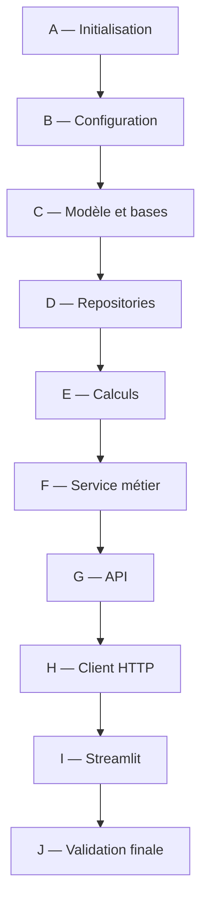

# Backlog Jira détaillé — Réimplémentation complète de LiMon Adjustment Manager

> Une déclinaison organisée à partir des écrans et du parcours utilisateur est
> disponible dans [backlog-jira-reimplementation-front-first.md](backlog-jira-reimplementation-front-first.md).
> Le présent document reste la déclinaison technique détaillée par couches.

## 1. Objet du document

Ce backlog permet à une équipe de développeurs Python de reconstruire l'application depuis un dépôt vide.

Architecture cible :

```text
Navigateur
  → Streamlit
  → client HTTP Python
  → FastAPI
  → service métier
  ├── pipeline pandas
  ├── repository Vertica
  └── repository PostgreSQL
```

Périmètre fonctionnel final :

- sélection `asofdate + version + fo_system + leg_flag` ;
- recherche serveur d'une ligne active ;
- sélection dans AG Grid ;
- modification du montant et de champs contrôlés ;
- preview Original / Reversal / Adjusted avec progression ;
- commit confirmé et idempotent ;
- annulation d'un trade ;
- registre des opérations ;
- review et revert append-only ;
- mode Supabase de simulation ;
- mode Vertica + PostgreSQL réel.

Le backlog ne comprend pas l'ancien frontend React, le batch multi-trade, les proxy trades, le SSO ou une orchestration Airflow.

## 2. Règles non négociables

Tous les tickets doivent préserver les invariants suivants :

1. La table de sortie est append-only : aucun `UPDATE` et aucun `DELETE`.
2. Un remplacement écrit `REVERSAL + ADJUSTED`.
3. Une annulation écrit uniquement `REVERSAL`.
4. Un revert est une nouvelle opération, jamais une suppression.
5. Le contexte complet est obligatoire.
6. Le commit relit la ligne active depuis la base.
7. Preview et commit utilisent le même constructeur de lignes.
8. Les retries exacts réutilisent la même clé d'idempotence.
9. Les noms physiques des colonnes restent dans le YAML.
10. Streamlit ne se connecte jamais directement aux bases.
11. Les routes API et le service métier ne contiennent pas de SQL.
12. Les erreurs API sont affichées, jamais transformées en listes vides.

## 3. Definition of Done commune

Un ticket est terminé lorsque :

- le code est typé et commenté lorsque la logique n'est pas évidente ;
- les responsabilités de couche sont respectées ;
- les tests unitaires concernés passent sans base externe ;
- les scénarios d'erreur sont testés ;
- `git diff --check` ne remonte rien ;
- les exemples Swagger sont actualisés pour une route ;
- la documentation est actualisée pour un comportement ou une configuration ;
- aucun secret n'est ajouté au dépôt.

Estimations indicatives : `S = 0,5–1 jour`, `M = 1–2 jours`, `L = 3–5 jours`.

---

# EPIC A — Initialisation du projet

## LIMON-PY-001 — Créer le squelette Python

**Objectif**
Créer un dépôt exécutable avec les packages de l'application, des tests et de la documentation.

**Étapes techniques**

1. Créer `streamlit_app/` comme package Python avec `__init__.py`.
2. Créer les fichiers vides : `app.py`, `client.py`, `api.py`, `api_models.py`, `models.py`, `service.py`, `calculations.py`, `jobs.py`, `storage.py`, `runtime.py`, `config.py`.
3. Créer `streamlit_app/tests/`, `streamlit_app/migrations/` et `streamlit_app/sql/`.
4. Ajouter `requirements.txt` avec Streamlit, FastAPI, Uvicorn, Pydantic, pandas, httpx, psycopg, vertica-python, PyYAML, python-dotenv, pytest et streamlit-aggrid.
5. Ajouter `.env.example` sans valeur sensible.
6. Ajouter les commandes de lancement et de test au README.
7. Configurer `.gitignore` pour `.env`, `.venv`, caches Python, IDE et fichiers système.

**Critères d'acceptation**

- `python -c "import streamlit_app"` réussit.
- FastAPI et Streamlit peuvent démarrer avec une page temporaire.
- `pytest` découvre le dossier de tests.

**Tests**

- Smoke test d'import du package.

**Dépendances** : aucune.
**Estimation** : S.

## LIMON-PY-002 — Définir les conventions et l'architecture

**Objectif**
Éviter que la logique métier, le SQL et la présentation soient mélangés.

**Étapes techniques**

1. Documenter le flux `Streamlit → client → API → service → repositories`.
2. Définir la responsabilité et les imports autorisés pour chaque module.
3. Documenter les invariants append-only, contexte, idempotence et lignée.
4. Interdire le SQL dans `app.py`, `api.py` et `service.py`.
5. Définir une convention de clés sémantiques en `snake_case`.
6. Définir la stratégie de tests avec repositories fakes.

**Critères d'acceptation**

- Un document d'architecture est relu par les développeurs.
- Chaque futur ticket peut être rattaché à une couche propriétaire.

**Dépendances** : LIMON-PY-001.
**Estimation** : S.

## LIMON-PY-003 — Configurer la qualité et l'intégration continue

**Objectif**
Obtenir un retour automatique sur chaque changement.

**Étapes techniques**

1. Configurer Ruff ou Flake8 pour le lint.
2. Configurer Black si l'équipe souhaite un formatage automatique.
3. Configurer mypy progressivement sur les modules métier.
4. Ajouter une commande unique `make check` ou un script équivalent.
5. Créer une CI exécutant compilation, lint et pytest.
6. Exclure les tests nécessitant Vertica/Supabase de la suite par défaut.

**Critères d'acceptation**

- La CI passe sur la branche initiale.
- Une erreur de syntaxe ou un test en échec bloque la pull request.

**Dépendances** : LIMON-PY-001.
**Estimation** : S.

---

# EPIC B — Configuration métier

## LIMON-PY-010 — Concevoir le catalogue YAML

**Objectif**
Séparer les clés utilisées par Python des noms de colonnes physiques.

**Étapes techniques**

1. Créer `project.yaml` pour Vertica réel.
2. Créer `project.supabase.yaml` pour la simulation PostgreSQL.
3. Définir `project.output_schema` et `project.output_table`.
4. Définir `record_types` pour BASE, REVERSAL et ADJUSTED.
5. Déclarer chaque champ sous une clé sémantique : `column`, `label`, et éventuellement `additive`.
6. Déclarer `technical_fields` : record type, adjustment reference, source ID et parent ID.
7. Déclarer `display_fields`.
8. Déclarer `editable_fields` avec widget et options contrôlées.
9. Déclarer la fonction de calcul et les patterns additifs revus.

**Critères d'acceptation**

- Les deux YAML exposent les mêmes clés sémantiques.
- Les noms physiques peuvent différer entre les environnements.
- Aucune colonne métier physique n'est codée en dur dans l'UI ou le service.

**Tests**

- Chargement YAML.
- Unicité des champs ajustables.
- Existence de chaque champ affiché/ajustable dans `fields`.
- Options non vides et sans doublons.

**Dépendances** : LIMON-PY-002.
**Estimation** : M.

## LIMON-PY-011 — Implémenter `Settings` et `load_settings`

**Objectif**
Construire un objet de configuration validé à partir du YAML et de l'environnement.

**Étapes techniques**

1. Créer une dataclass immutable `Settings`.
2. Implémenter `column(semantic_key)`.
3. Implémenter `additive_columns`, `output_columns` et `is_additive`.
4. Charger `.env`, puis `.env.streamlit`, sans écraser les variables exportées.
5. Sélectionner le YAML selon `OUTPUT_DATABASE`.
6. Charger les URLs PostgreSQL et les paramètres Vertica.
7. Refuser les hostnames placeholders.
8. Charger `ADJUSTMENT_ACTOR` et le délai de calcul simulé.

**Critères d'acceptation**

- Le mode Supabase est automatiquement sélectionnable.
- Une configuration invalide donne une erreur explicite au démarrage.
- Aucun secret n'est loggé.

**Tests**

- Priorité des variables d'environnement.
- Choix du bon YAML.
- Traduction sémantique/physique.
- Détection des colonnes additives.

**Dépendances** : LIMON-PY-010.
**Estimation** : M.

---

# EPIC C — Modèle de données

## LIMON-PY-020 — Définir les contrats métier Python

**Objectif**
Créer des objets indépendants de FastAPI et Streamlit.

**Étapes techniques**

1. Créer la dataclass immutable `Context`.
2. Créer `AdjustmentDraft`.
3. Créer `CancellationDraft`.
4. Créer `Preview` avec original, reversal, adjusted et étapes.
5. Créer `CancellationPreview`.
6. Documenter les types et exemples dans les docstrings.

**Critères d'acceptation**

- `models.py` n'importe ni Streamlit, ni FastAPI, ni driver SQL.
- Les objets peuvent être instanciés dans des tests simples.

**Tests**

- Immutabilité des dataclasses.
- Valeurs par défaut des changements et étapes.

**Dépendances** : LIMON-PY-001.
**Estimation** : S.

## LIMON-PY-021 — Créer les modèles HTTP Pydantic

**Objectif**
Valider les requêtes avant leur arrivée dans le service métier.

**Étapes techniques**

1. Créer `ContextBody` avec `leg_flag` limité à 0 ou 1.
2. Créer `AdjustmentBody`.
3. Créer `CancellationBody`.
4. Créer `RevertBody`.
5. Ajouter des exemples JSON Swagger.
6. Créer les méthodes de conversion vers les dataclasses métier.

**Critères d'acceptation**

- Une requête mal formée produit HTTP 422.
- Les modèles HTTP ne sont pas utilisés comme modèles de stockage.

**Tests**

- Contexte valide et invalide.
- Motif vide.
- Leg hors domaine.
- Structure des changements.

**Dépendances** : LIMON-PY-020.
**Estimation** : S.

## LIMON-PY-022 — Créer la migration PostgreSQL

**Objectif**
Créer l'unique table de métadonnées `adjustment_operations`.

**Étapes techniques**

1. Écrire une migration forward-only.
2. Ajouter les colonnes d'identité, contexte, source, motif, acteur et timestamps.
3. Ajouter `payload JSONB`, `output_ids JSONB` et `error_message`.
4. Ajouter `reverts_operation_id`.
5. Ajouter la contrainte unique sur `idempotency_key`.
6. Ajouter les contraintes sur type et statut.
7. Ajouter les index contexte, source, statut et revert.

**Critères d'acceptation**

- La migration s'applique sur une base vide.
- Elle n'effectue aucune destruction implicite.
- Une seconde clé d'idempotence identique est refusée.

**Tests**

- Test d'intégration de migration dans une base jetable.

**Dépendances** : LIMON-PY-002.
**Estimation** : M.

## LIMON-PY-023 — Préparer les colonnes techniques Vertica

**Objectif**
Permettre à la table de sortie de porter les lignes et leur lignée.

**Étapes techniques**

1. Faire confirmer l'identifiant unique de la ligne métier.
2. Ajouter ou mapper `record_type`.
3. Ajouter ou mapper `adjustment_reference`.
4. Ajouter ou mapper `source_output_record_id`.
5. Ajouter ou mapper `parent_output_record_id`.
6. Faire valider types et longueurs par le DBA.
7. Définir les valeurs physiques de record type.
8. Documenter la requête permettant d'identifier une ligne active.

**Critères d'acceptation**

- Les lignes générées peuvent être insérées sans modifier les colonnes métier.
- Les IDs déterministes tiennent dans les colonnes.
- Power BI peut filtrer sur le record type.

**Dépendances** : LIMON-PY-010.
**Estimation** : M.

## LIMON-PY-024 — Créer la simulation Supabase

**Objectif**
Tester le comportement réel sans accès Vertica.

**Étapes techniques**

1. Créer le schéma `vertica_sim`.
2. Créer `output_completude_table` avec colonnes métier et techniques.
3. Créer le schéma de métadonnées.
4. Appliquer la migration des opérations.
5. Charger des données couvrant plusieurs contextes.
6. Ajouter des trades Cash/Titre, Murex/Orchestrade et des montants variés.
7. Ne pas stocker la chaîne de connexion dans Git.

**Critères d'acceptation**

- L'application peut exécuter le parcours complet sur Supabase.
- Les exemples proviennent de la base et non du code Python.

**Dépendances** : LIMON-PY-022, LIMON-PY-023.
**Estimation** : M.

---

# EPIC D — Accès aux données

## LIMON-PY-030 — Implémenter `SqlOutputStore`

**Objectif**
Centraliser les accès à la table métier, compatibles Vertica et simulation PostgreSQL.

**Étapes techniques**

1. Injecter une factory de connexion et `Settings`.
2. Implémenter un quoting strict des identifiants configurés.
3. Implémenter `context_values` avec filtres paramétrés.
4. Implémenter `search_active` avec contexte complet, Trade/ISIN et limite.
5. Implémenter `get_active` avec `SELECT o.*`.
6. Implémenter `get_by_id` pour l'historique.
7. Implémenter `reference_exists`.
8. Implémenter `append(rows)` avec `executemany`, commit et rollback.
9. Fermer connexion et curseur dans tous les cas.

**Critères d'acceptation**

- Toutes les valeurs utilisent des paramètres SQL.
- Seuls les identifiants issus du YAML sont interpolés après quoting.
- Une ligne neutralisée par une reversal n'est pas active.
- `append` est atomique dans la base de sortie.

**Tests**

- SQL généré et paramètres.
- Ligne BASE active/inactive.
- Ligne ADJUSTED active/inactive.
- Limite de recherche.
- Commit et rollback.

**Dépendances** : LIMON-PY-011, LIMON-PY-023.
**Estimation** : L.

## LIMON-PY-031 — Implémenter `PostgresOperationStore`

**Objectif**
Persister une opération par intention utilisateur.

**Étapes techniques**

1. Injecter la factory PostgreSQL et le schéma.
2. Implémenter `find_by_key`.
3. Implémenter `get_operation`.
4. Implémenter `create` en statut PENDING avec `ON CONFLICT DO NOTHING`.
5. Implémenter `set_status`.
6. Implémenter `commit_revert` dans une transaction PostgreSQL.
7. Implémenter `list_recent` avec limite.
8. Sérialiser proprement JSON, dates et IDs.

**Critères d'acceptation**

- Un retry ne crée pas une seconde opération.
- Une confirmation COMMITTED conserve les IDs de sortie.
- Revert et mise à jour de la cible sont atomiques dans PostgreSQL.

**Tests**

- Création, conflit, changement de statut et lecture.
- Transaction de revert.
- Ordre du registre.

**Dépendances** : LIMON-PY-022.
**Estimation** : M.

## LIMON-PY-032 — Construire le runtime et les connexions

**Objectif**
Assembler les dépendances une seule fois par processus FastAPI.

**Étapes techniques**

1. Créer les factories PostgreSQL et Vertica.
2. Choisir la factory de sortie selon `OUTPUT_DATABASE`.
3. Construire `SqlOutputStore` et `PostgresOperationStore`.
4. Construire `AdjustmentService`.
5. Retourner un objet Runtime.
6. Mettre en cache le graphe avec `lru_cache(maxsize=1)`.
7. Ouvrir une connexion seulement lors d'une opération de repository.

**Critères d'acceptation**

- Le mode Supabase utilise deux repositories logiques sur PostgreSQL.
- Le mode réel utilise Vertica pour la sortie et PostgreSQL pour l'audit.
- Le service reste identique dans les deux modes.

**Tests**

- Sélection des factories avec mocks.
- Erreur propre lorsqu'une configuration manque.

**Dépendances** : LIMON-PY-030, LIMON-PY-031.
**Estimation** : M.

---

# EPIC E — Calculs

## LIMON-PY-040 — Définir les fonctions d'enrichissement

**Objectif**
Découper les recalculs LiMon en fonctions DataFrame lisibles.

**Étapes techniques**

1. Créer la classe ou bibliothèque `Calculation`.
2. Créer une fonction par étape métier.
3. Faire recevoir et retourner un DataFrame complet.
4. Utiliser le mapping sémantique fourni, sans noms physiques codés en dur.
5. Interdire l'accès aux bases dans ces fonctions.
6. Documenter inputs, outputs et règles pour chaque fonction.

**Critères d'acceptation**

- Les fonctions sont testables avec un petit DataFrame.
- Elles ne dépendent ni de FastAPI ni de Streamlit.

**Tests**

- Cas normal, valeurs nulles, limites métier et types.

**Dépendances** : LIMON-PY-010.
**Estimation** : L selon les règles LiMon.

## LIMON-PY-041 — Implémenter le pipeline ordonné

**Objectif**
Exécuter uniquement le suffixe de calcul impacté.

**Étapes techniques**

1. Créer une dataclass `Stage(name, function, outputs)`.
2. Déclarer l'ordre explicitement.
3. Déclarer `input_start_stage` pour les inputs.
4. Calculer l'étape la plus ancienne impactée par plusieurs changements.
5. Appliquer les overrides avant la première étape.
6. Réappliquer les overrides après chaque étape.
7. Vérifier que le nombre de lignes ne change pas.
8. Retourner la ligne calculée et les noms des étapes exécutées.

**Critères d'acceptation**

- Une modification de montant commence aux buckets.
- Une modification d'un output d'étape commence après cette étape.
- Plusieurs changements commencent au plus tôt nécessaire.
- Un override utilisateur n'est jamais écrasé.

**Tests**

- Ordre complet et ordres partiels.
- Plusieurs champs.
- Override prioritaire.
- Erreur de cardinalité.

**Dépendances** : LIMON-PY-040.
**Estimation** : M.

## LIMON-PY-042 — Ajouter la progression du calcul

**Objectif**
Permettre à une couche externe d'afficher l'étape courante.

**Étapes techniques**

1. Ajouter un callback optionnel au pipeline.
2. Émettre RUNNING avant chaque étape.
3. Émettre COMPLETED après chaque étape.
4. Inclure index, total et nom d'étape.
5. Ajouter un délai simulé configurable uniquement pour le développement.
6. Laisser les exceptions remonter au gestionnaire de job.

**Critères d'acceptation**

- Le calcul fonctionne sans callback.
- Les événements sont ordonnés et atteignent 100 %.
- Le délai par défaut vaut zéro.

**Tests**

- Suite exacte des événements.
- Erreur d'une étape.
- Délai désactivé par défaut.

**Dépendances** : LIMON-PY-041.
**Estimation** : S.

---

# EPIC F — Service métier

## LIMON-PY-050 — Implémenter la validation du brouillon

**Objectif**
Transformer un brouillon en changements autorisés.

**Étapes techniques**

1. Déduire le montant à modifier depuis `leg_flag`.
2. Convertir le montant en numérique.
3. Vérifier que chaque champ appartient à `editable_fields`.
4. Vérifier la valeur contre les options YAML.
5. Comparer les changements à la ligne active.
6. Refuser un no-op.
7. Normaliser le motif.

**Critères d'acceptation**

- Cash et Titre modifient des colonnes distinctes.
- Un champ ou une valeur inconnue est refusé.
- Au moins une modification réelle est requise.

**Tests**

- Montants Cash/Titre.
- Champ autorisé/interdit.
- Valeur autorisée/interdite.
- No-op.

**Dépendances** : LIMON-PY-011, LIMON-PY-020.
**Estimation** : M.

## LIMON-PY-051 — Construire le preview de remplacement

**Objectif**
Produire Original, Reversal et Adjusted sans écriture.

**Étapes techniques**

1. Relire la source avec `get_active`.
2. Vérifier le contexte complet.
3. Copier la ligne originale complète.
4. Créer `REV-{key}`.
5. Négativer toutes les colonnes additives configurées.
6. Créer `ADJ-{key}`.
7. Appliquer les changements validés.
8. Appeler le pipeline de calcul.
9. Renseigner record type, référence, source et parent.
10. Retourner l'objet Preview.

**Critères d'acceptation**

- Aucune écriture n'est réalisée.
- Les colonnes non affichées sont préservées.
- La reversal porte l'opposé de chaque mesure additive.
- La ligne adjusted contient les valeurs demandées et recalculées.

**Tests**

- Valeurs et IDs des trois lignes.
- Contexte incorrect.
- Source inactive.
- Colonnes additives nulles et numériques.

**Dépendances** : LIMON-PY-030, LIMON-PY-041, LIMON-PY-050.
**Estimation** : L.

## LIMON-PY-052 — Implémenter le commit idempotent

**Objectif**
Écrire un remplacement sans doublon et conserver l'audit.

**Étapes techniques**

1. Rechercher l'opération par clé.
2. Comparer l'intention stockée à la requête complète.
3. Retourner une opération COMMITTED existante uniquement si l'intention est identique.
4. Relire et reconstruire le preview.
5. Créer PENDING avant l'écriture sortie.
6. Vérifier `adjustment_reference`.
7. Insérer reversal + adjusted dans une transaction sortie.
8. Passer PostgreSQL à COMMITTED avec les IDs.
9. Passer à FAILED si l'insert sortie échoue.
10. Détecter la sortie déjà écrite et confirmer PostgreSQL sans réinsérer.

**Critères d'acceptation**

- Deux appels identiques produisent une seule paire de lignes.
- Une clé réutilisée avec une autre intention produit un conflit.
- Une panne après Vertica est réconciliable.

**Tests**

- Premier commit.
- Retry exact.
- Retry modifié par champ, montant, motif, contexte ou source.
- Échec sortie.
- Échec confirmation PostgreSQL.
- Reconciliation.

**Dépendances** : LIMON-PY-031, LIMON-PY-051.
**Estimation** : L.

## LIMON-PY-053 — Implémenter l'annulation

**Objectif**
Neutraliser une ligne active en ajoutant une seule reversal.

**Étapes techniques**

1. Relire et valider la ligne active.
2. Copier la ligne complète.
3. Créer `REV-{key}`.
4. Négativer les mesures additives.
5. Créer une opération CANCEL PENDING.
6. Insérer une seule ligne.
7. Confirmer COMMITTED.
8. Réutiliser les règles d'idempotence et de réconciliation.

**Critères d'acceptation**

- Aucun remplacement n'est créé.
- La source disparaît des recherches actives.
- Son historique reste consultable.

**Tests**

- Annulation normale.
- Source inactive.
- Retry exact/modifié.
- Échecs des deux bases.

**Dépendances** : LIMON-PY-052.
**Estimation** : M.

## LIMON-PY-054 — Implémenter le revert

**Objectif**
Compenser un REPLACE ou CANCEL déjà committé.

**Étapes techniques**

1. Charger l'opération cible.
2. Vérifier son type et son statut.
3. Retrouver la source originale et l'éventuelle adjusted active.
4. Pour REPLACE, produire `-adjusted + restored adjusted`.
5. Pour CANCEL, produire une seule ligne restored adjusted.
6. Créer une opération REVERT avec `reverts_operation_id`.
7. Écrire les lignes dans la sortie.
8. Confirmer le REVERT et marquer la cible REVERTED dans une transaction PostgreSQL.
9. Appliquer idempotence et réconciliation.

**Critères d'acceptation**

- Aucun historique n'est supprimé.
- Une opération non committée n'est pas revertable.
- Le bon effet métier redevient actif.

**Tests**

- Revert REPLACE.
- Revert CANCEL.
- Cible absente, invalide, failed ou déjà revertée.
- Retry et panne partielle.

**Dépendances** : LIMON-PY-053.
**Estimation** : L.

---

# EPIC G — API FastAPI

## LIMON-PY-060 — Créer les endpoints de santé et contexte

**Étapes techniques**

1. Créer l'application FastAPI.
2. Injecter le Runtime via une dépendance remplaçable en test.
3. Ajouter `GET /health` sans requête métier lourde.
4. Ajouter les trois endpoints de contexte en cascade.
5. Convertir les erreurs de configuration/connexion en HTTP 503 sécurisé.

**Critères d'acceptation**

- Les valeurs viennent uniquement de la sortie.
- Une sortie vide retourne des listes vides.
- Une base indisponible n'est pas présentée comme vide.

**Tests**

- Succès, vide et indisponibilité.

**Dépendances** : LIMON-PY-032.
**Estimation** : M.

## LIMON-PY-061 — Créer l'endpoint de recherche

**Étapes techniques**

1. Ajouter `GET /trades`.
2. Déclarer tous les paramètres de contexte.
3. Ajouter `search` et une limite bornée.
4. Appeler `search_active`.
5. Sérialiser dates, décimaux et valeurs nulles.
6. Documenter un exemple Swagger.

**Critères d'acceptation**

- La limite maximale est imposée côté API.
- Aucune extraction complète n'est chargée.
- Seules les lignes actives sont renvoyées.

**Tests**

- Contexte, filtre, limite, 422 et 503.

**Dépendances** : LIMON-PY-060.
**Estimation** : S.

## LIMON-PY-062 — Exposer preview et commit

**Étapes techniques**

1. Ajouter `POST /adjustments/preview`.
2. Ajouter `POST /adjustments/commit`.
3. Convertir le body vers les dataclasses métier.
4. Traduire `AdjustmentError` en HTTP 409.
5. Traduire les indisponibilités en HTTP 503.
6. Ne pas reproduire les règles métier dans les routes.
7. Ajouter exemples Swagger de succès et conflit.

**Critères d'acceptation**

- La route preview n'écrit rien.
- La route commit renvoie opération, statut et IDs.

**Tests**

- Succès, validation 422, conflit 409 et indisponibilité 503.

**Dépendances** : LIMON-PY-052, LIMON-PY-021.
**Estimation** : M.

## LIMON-PY-063 — Implémenter les jobs de preview

**Objectif**
Afficher une progression sans bloquer une longue requête Streamlit.

**Étapes techniques**

1. Créer `PreviewJobManager` avec un thread pool borné.
2. Stocker les états PENDING, RUNNING, COMPLETED et FAILED.
3. Stocker étape courante, étapes terminées, pourcentage, résultat et erreur.
4. Protéger les dictionnaires avec un lock.
5. Ajouter `POST /adjustments/preview-jobs` retournant 202.
6. Ajouter `GET /adjustments/preview-jobs/{job_id}`.
7. Retourner 404 pour un job inconnu.
8. Documenter que ce mécanisme est mono-processus.

**Critères d'acceptation**

- La création retourne immédiatement un job ID.
- Le résultat final correspond au preview synchrone.
- Une exception devient FAILED avec message sécurisé.

**Tests**

- Succès, progression, erreur, job inconnu.
- Tests non sensibles à des timings exacts.

**Dépendances** : LIMON-PY-042, LIMON-PY-062.
**Estimation** : M.

## LIMON-PY-064 — Exposer cancel, registre et revert

**Étapes techniques**

1. Ajouter `POST /adjustments/cancel`.
2. Ajouter `GET /adjustments` avec limite.
3. Ajouter `POST /adjustments/{operation_id}/revert`.
4. Appliquer les mêmes traductions d'erreurs.
5. Ajouter exemples Swagger.

**Critères d'acceptation**

- Le registre vient uniquement de PostgreSQL.
- Cancel et revert renvoient les IDs générés.

**Tests**

- Succès et erreurs pour chaque route.

**Dépendances** : LIMON-PY-053, LIMON-PY-054.
**Estimation** : M.

---

# EPIC H — Client HTTP Python

## LIMON-PY-070 — Implémenter `AdjustmentApiClient`

**Objectif**
Créer l'unique frontière HTTP utilisée par Streamlit.

**Étapes techniques**

1. Injecter URL de base et timeout.
2. Créer `_request` avec parsing JSON.
3. Convertir HTTPX et erreurs HTTP en `ApiError` lisible.
4. Ajouter une méthode par endpoint.
5. Centraliser la sérialisation d'un brouillon.
6. Donner 120 secondes au commit et conserver 30 secondes pour les appels ordinaires.
7. Ne jamais exposer stack trace, URL avec secret ou SQL.

**Critères d'acceptation**

- `app.py` ne contient aucun appel `httpx` direct.
- Le timeout du commit est indépendant du timeout normal.

**Tests**

- URL, méthode, params et JSON de chaque famille d'appel.
- Message HTTP et transport.
- Timeout commit.

**Dépendances** : LIMON-PY-064.
**Estimation** : M.

---

# EPIC I — Interface Streamlit

## LIMON-PY-080 — Créer le shell et la gestion d'état

**Étapes techniques**

1. Configurer la page wide.
2. Charger Settings et client avec `st.cache_resource`.
3. Créer les onglets Workspace et Register.
4. Définir les clés `session_state`.
5. Créer `reset_draft`.
6. Effacer état aval lors d'un changement de contexte ou sélection.
7. Ajouter des helpers d'affichage basés sur les labels YAML.

**Critères d'acceptation**

- Aucun objet de stockage n'est importé par `app.py`.
- Un rerun conserve uniquement l'état encore valide.

**Tests**

- Helpers purs de signature et normalisation.

**Dépendances** : LIMON-PY-011, LIMON-PY-070.
**Estimation** : M.

## LIMON-PY-081 — Construire les filtres de contexte

**Étapes techniques**

1. Charger les dates depuis l'API.
2. Utiliser `st.date_input`.
3. Charger les versions après la date.
4. Charger les FO systems après date/version.
5. Ajouter Cash/Titre et convertir vers 0/1.
6. Bloquer les étapes suivantes si la combinaison est vide.
7. Afficher les erreurs API.

**Critères d'acceptation**

- Aucun choix n'est hardcodé hors Cash/Titre.
- Une base vide affiche un état vide explicite.

**Dépendances** : LIMON-PY-080.
**Estimation** : M.

## LIMON-PY-082 — Construire la recherche AG Grid

**Étapes techniques**

1. Ajouter champ Trade/ISIN, Search et Clear alignés.
2. Appeler le client avec le contexte complet.
3. Construire le DataFrame avec labels YAML.
4. Configurer tri, filtres et redimensionnement.
5. Configurer une sélection unique par checkbox.
6. Résoudre la ligne API complète depuis l'output ID sélectionné.
7. Clear doit effacer recherche, résultats, sélection et preview.

**Critères d'acceptation**

- AG Grid ne reçoit que le résultat borné de l'API.
- Une sélection correspond toujours à une ligne API complète.

**Dépendances** : LIMON-PY-081.
**Estimation** : M.

## LIMON-PY-083 — Construire l'éditeur dynamique 3 colonnes

**Étapes techniques**

1. Afficher la ligne active sélectionnée.
2. Déduire le montant depuis le leg.
3. Créer une fonction pure regroupant montant + `editable_fields` par lignes de trois.
4. Générer les selectbox depuis le YAML.
5. Envoyer uniquement les différences.
6. Ajouter le motif obligatoire.
7. Placer les widgets dans un `st.form`.

**Critères d'acceptation**

- Montant + 2 champs occupent une ligne.
- 5 champs configurés produisent deux lignes de trois.
- L'ordre YAML est conservé.
- Aucun widget spécifique n'est nécessaire pour un nouveau select contrôlé.

**Tests**

- 0, 2, 3 et 5 champs.
- Ligne incomplète.
- Ordre et absence de mutation de la configuration.

**Dépendances** : LIMON-PY-082.
**Estimation** : M.

## LIMON-PY-084 — Construire le preview avec progression

**Étapes techniques**

1. Valider motif et présence d'une modification.
2. Calculer une signature canonique du brouillon.
3. Générer une nouvelle clé seulement si l'intention change.
4. Stocker `pending_preview_draft`.
5. Activer `preview_in_progress` et relancer Streamlit.
6. Afficher le bouton Preview désactivé avant le polling.
7. Créer le job et poller environ toutes les 400–500 ms.
8. Afficher étapes terminées, étape courante et progression.
9. Consommer le pending draft une seule fois.
10. Libérer le verrou dans un `finally`.
11. Stocker preview et preview_draft après succès.

**Critères d'acceptation**

- Un double clic ne démarre pas deux pipelines.
- Timeout et erreur sont visibles.
- Le preview contient Original, Reversal et Adjusted.

**Dépendances** : LIMON-PY-063, LIMON-PY-083.
**Estimation** : L.

## LIMON-PY-085 — Ajouter la confirmation et le verrou du commit

**Étapes techniques**

1. Ouvrir un grand dialogue depuis Commit.
2. Afficher contexte, source, leg et motif.
3. Afficher ligne courante et résultat attendu.
4. Exiger une checkbox de confirmation.
5. Désactiver Back et Confirm lorsque `commit_in_progress` est actif.
6. Afficher `st.status` et une barre d'activité pendant l'appel.
7. Envoyer exactement `preview_draft`.
8. Conserver la clé après une erreur incertaine.
9. Après succès, effacer résultats, sélection et draft, puis afficher un message durable.

**Critères d'acceptation**

- Aucun commit sans confirmation.
- Le brouillon ne peut pas être changé pendant l'appel.
- Un double clic ne crée pas de doublon.
- La progression ne prétend pas connaître des étapes serveur non exposées.

**Dépendances** : LIMON-PY-084.
**Estimation** : M.

## LIMON-PY-086 — Ajouter le dialogue Cancel

**Étapes techniques**

1. Ajouter un bouton destructif près de l'ajustement.
2. Ouvrir un dialogue rappelant l'effet zéro.
3. Afficher la ligne sélectionnée.
4. Exiger motif et confirmation.
5. Calculer une signature de cancellation.
6. Conserver la clé pour un retry identique.
7. Appeler l'API et nettoyer l'état après succès.

**Critères d'acceptation**

- L'utilisateur comprend qu'aucun remplacement ne sera créé.
- Une erreur conserve l'intention pour retry.

**Dépendances** : LIMON-PY-085.
**Estimation** : M.

## LIMON-PY-087 — Construire le registre, Review et Revert

**Étapes techniques**

1. Charger le registre via le client.
2. Grouper par date puis version.
3. Afficher métriques et cartes compactes.
4. Créer un grand dialogue Review.
5. Afficher changements, motif, auteur, dates et IDs.
6. Proposer Revert uniquement pour REPLACE/CANCEL en COMMITTED.
7. Utiliser un bouton rouge.
8. Exiger motif et confirmation.
9. Actualiser le registre après succès.
10. Relier visuellement REVERT et opération cible.

**Critères d'acceptation**

- Les opérations revertées sont identifiables.
- Une opération non éligible n'affiche pas Revert.
- Les erreurs sont visibles.

**Dépendances** : LIMON-PY-086.
**Estimation** : L.

---

# EPIC J — Validation finale

## LIMON-PY-090 — Compléter les tests unitaires et API

**Étapes techniques**

1. Créer des fakes OutputStore et OperationStore.
2. Couvrir toutes les règles de remplacement.
3. Couvrir cancel et revert.
4. Couvrir pipeline et jobs.
5. Couvrir configuration et grille UI pure.
6. Couvrir tous les endpoints et codes HTTP.
7. Vérifier qu'aucun test unitaire ne requiert une vraie base.

**Critères d'acceptation**

- Suite déterministe et rapide.
- Matrice succès, invalidité, panne et retry couverte.

**Dépendances** : tous les tickets d'implémentation.
**Estimation** : L.

## LIMON-PY-091 — Exécuter les tests d'intégration Supabase

**Étapes techniques**

1. Créer un jeu de données jetable.
2. Tester les filtres de contexte.
3. Tester la recherche active.
4. Tester REPLACE, second REPLACE, CANCEL et REVERT.
5. Vérifier les sommes additives.
6. Vérifier le registre PostgreSQL.
7. Tester une contrainte de longueur invalide.
8. Nettoyer uniquement le jeu de données de test identifié.

**Critères d'acceptation**

- Tous les parcours ont l'effet attendu dans les deux schémas.
- Aucun secret ou résultat de test n'est committé.

**Dépendances** : LIMON-PY-024, LIMON-PY-090.
**Estimation** : M.

## LIMON-PY-092 — Qualifier Vertica et PostgreSQL réels

**Étapes techniques**

1. Vérifier connectivité, TLS et permissions minimales.
2. Comparer les noms/types/longueurs au YAML.
3. Analyser le plan des recherches actives.
4. Mesurer la recherche sur un gros as-of date.
5. Tester un commit dans un environnement non productif.
6. Injecter un échec Vertica puis PostgreSQL.
7. Vérifier la réconciliation.
8. Valider les calculs avec un golden dataset.

**Critères d'acceptation**

- Les performances sont acceptées par les utilisateurs.
- Les pannes partielles ont une procédure de récupération démontrée.
- Les résultats sont validés par le métier.

**Dépendances** : LIMON-PY-091.
**Estimation** : L.

## LIMON-PY-093 — Préparer l'exploitation

**Étapes techniques**

1. Configurer logs structurés avec operation ID et idempotency key.
2. Créer alertes sur FAILED et réconciliation.
3. Écrire un runbook pour chaque panne de base.
4. Documenter démarrage, arrêt, configuration et rollback applicatif.
5. Définir sauvegarde et rétention PostgreSQL.
6. Définir SLO et propriétaire de support.
7. Documenter la limite mono-worker des jobs ou la remplacer avant montée en charge.

**Critères d'acceptation**

- Un opérateur peut diagnostiquer une opération sans lire le code.
- Les secrets sont gérés hors du dépôt.
- Les responsabilités d'exploitation sont attribuées.

**Dépendances** : LIMON-PY-092.
**Estimation** : L.

## LIMON-PY-094 — Réaliser la recette et le go-live

**Étapes techniques**

1. Construire un cahier de recette par opération.
2. Faire exécuter les scénarios par les utilisateurs métier.
3. Corriger les anomalies bloquantes.
4. Obtenir les validations fonctionnelle, DBA, sécurité et exploitation.
5. Déployer avec une fenêtre contrôlée.
6. Réaliser un smoke test en lecture.
7. Réaliser un ajustement supervisé si autorisé.
8. Surveiller erreurs, durées et cohérence des bases.

**Critères d'acceptation**

- PV de recette signé.
- Aucun écart critique de calcul ou d'audit.
- Runbook, support et rollback disponibles.

**Dépendances** : LIMON-PY-093.
**Estimation** : M hors délais de validation.

---

## 4. Ordre d'implémentation recommandé



## 5. Jalons livrables

| Jalon | Tickets | Démonstration attendue |
|---|---|---|
| M0 — Socle | 001–024 | Projet, configuration et schémas disponibles |
| M1 — Lecture | 030–032, 060–061, 070, 080–082 | Recherche d'un trade actif dans Streamlit |
| M2 — Preview | 040–051, 062–063, 083–084 | Preview avec calcul et progression |
| M3 — Ajustement complet | 052–054, 064, 085–087 | Commit, cancel, register et revert |
| M4 — Qualification | 090–094 | Application testée et exploitable |

## 6. Compétences Python nécessaires

| Compétence | Niveau attendu | Tickets concernés |
|---|---|---|
| Python, dataclasses, exceptions | Solide | Tous |
| pytest, fixtures, monkeypatch | Solide | 003, 010–011, 020–094 |
| pandas | Solide | 040–042, 051 |
| FastAPI et Pydantic | Intermédiaire | 021, 060–064 |
| Streamlit et session state | Intermédiaire | 080–087 |
| httpx | Intermédiaire | 070 |
| SQL et transactions | Solide | 022–032, 052–054 |
| PostgreSQL | Solide | 022, 024, 031 |
| Vertica | Intermédiaire avec support DBA | 023, 030, 092 |
| CI/CD et exploitation | Intermédiaire | 003, 093–094 |

## 7. Risques à suivre dans Jira

- Fonctions de calcul non équivalentes à LiMon.
- Colonne additive oubliée, produisant des totaux Power BI incorrects.
- Longueur de colonne insuffisante lors du commit.
- Recherche active trop lente sur Vertica.
- Échec entre commit Vertica et confirmation PostgreSQL.
- Perte d'un job de preview après redémarrage FastAPI.
- Double usage d'une clé d'idempotence pour des intentions différentes.
- Configuration différente entre YAML Supabase et Vertica.
- Utilisation multi-worker avant remplacement du gestionnaire de jobs mémoire.
- Absence d'identité réelle si l'application devient multi-utilisateur.
