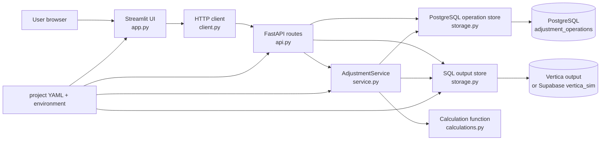
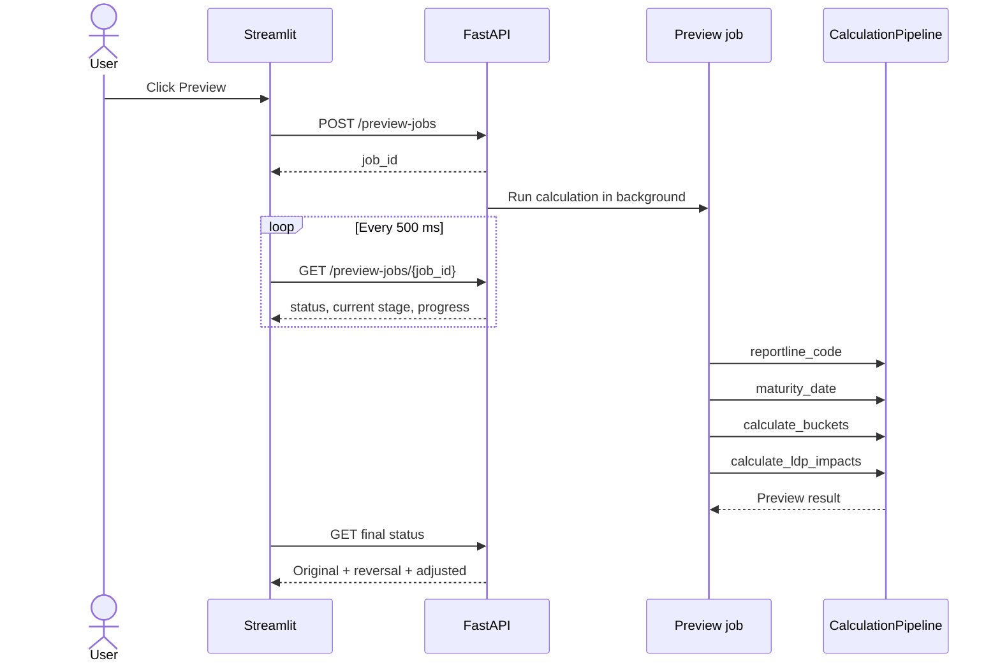
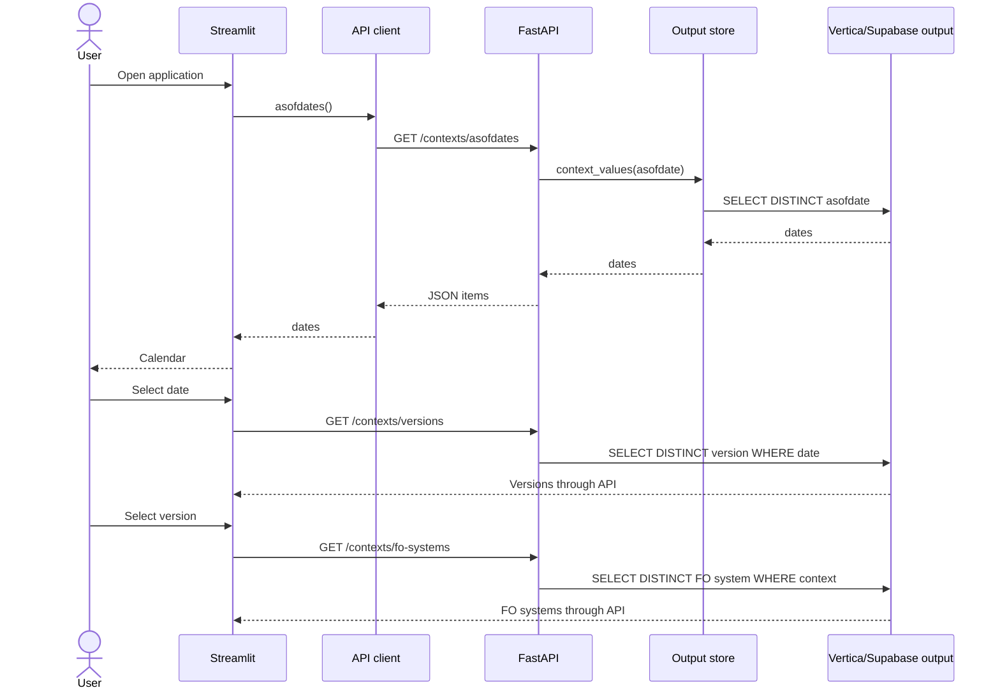
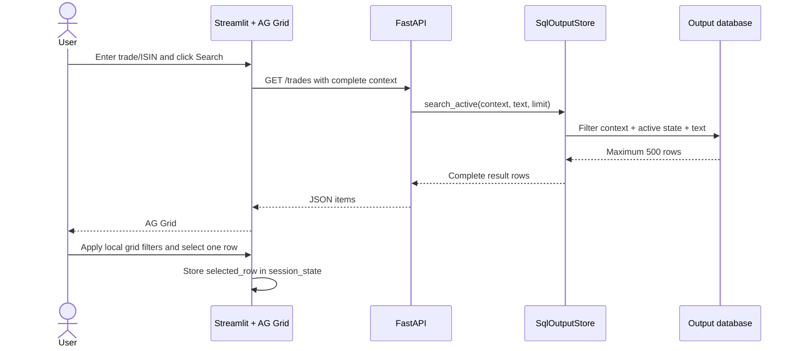
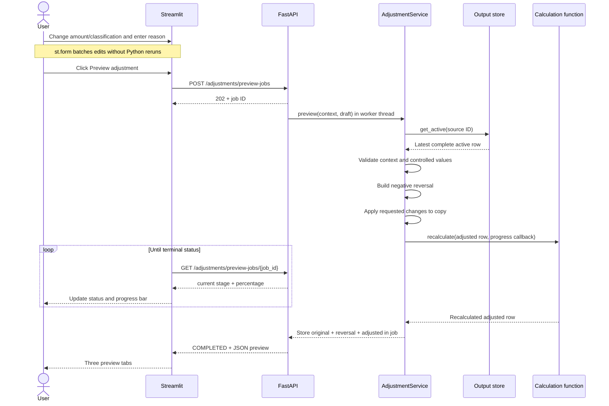
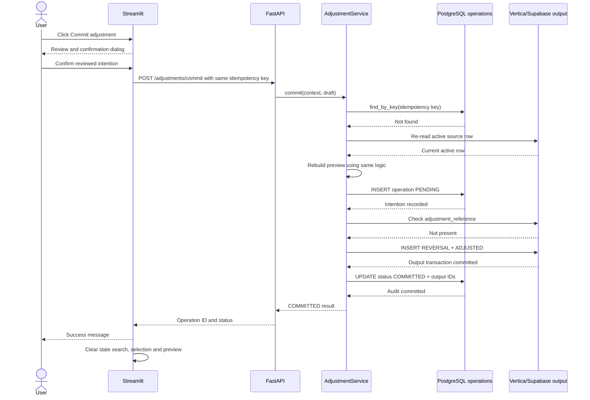
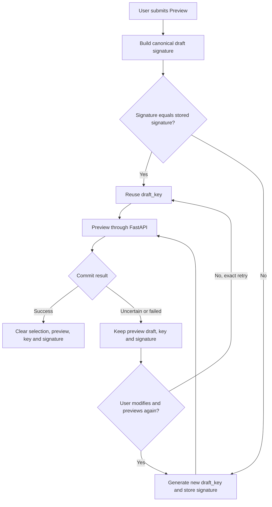
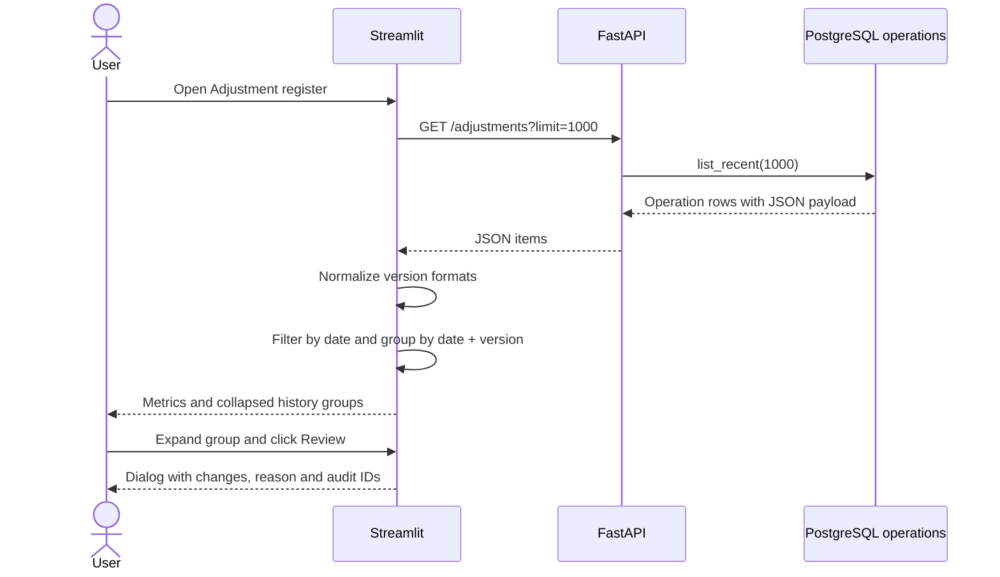
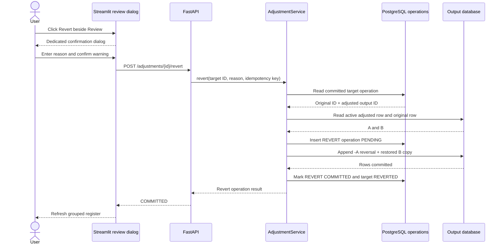
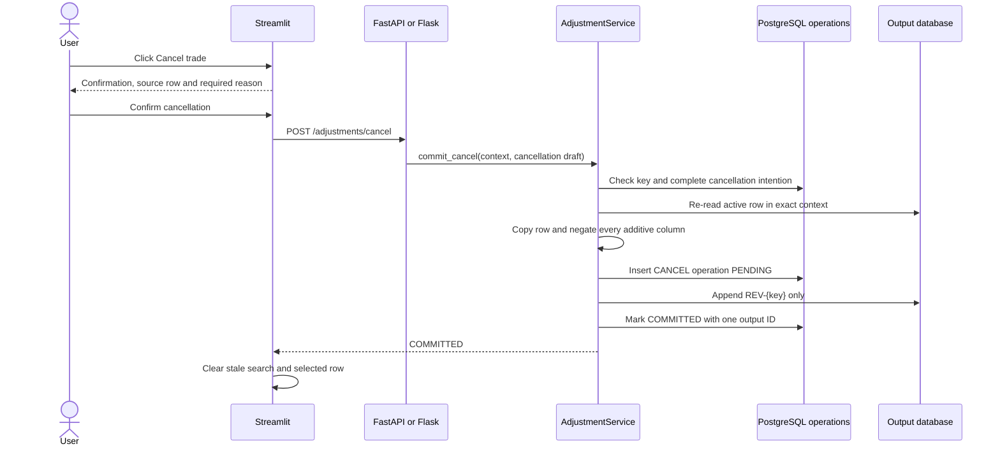

# LiMon Streamlit + FastAPI — architecture and developer guide

This document explains the simplified application under `streamlit_app/`. It
is intended for a developer who knows Python but is new to Streamlit, FastAPI,
or this codebase.

## 1. Purpose and scope

The application lets a user find an active LiMon output row, prepare controlled
changes, preview the accounting effect, and append the result to the output
table. It never updates or deletes an output fact.

The current vertical slice supports:

- context selection by as-of date, version, FO system and Cash/Titre leg;
- server-side trade/ISIN search and client-side AG Grid filtering;
- adjustment of the selected leg amount;
- controlled adjustment of exposure class and reporting line LCR;
- original, reversal and adjusted preview;
- idempotent append-only commit;
- adjustment history grouped by as-of date and version;
- Supabase as a development simulation of both databases;
- a real Vertica output plus PostgreSQL metadata configuration for production.

It does not yet implement proxy trades, multi-trade batch commit,
authentication or the final production LiMon calculation library.

## 2. Architecture at a glance



The central dependency rule is:

```text
Streamlit UI → HTTP client → FastAPI → domain service → storage/calculation
```

Streamlit does not import `psycopg`, `vertica_python`, a SQL store, or the
calculation engine. The API is the only process allowed to execute business
logic and database operations.

## 3. Runtime processes

Two Python processes run locally.

### FastAPI process

```bash
PYTHONPATH=. .venv/bin/uvicorn streamlit_app.api:app --reload --port 8001
```

It owns:

- database connections;
- SQL filtering;
- context and active-row validation;
- controlled-value validation;
- calculations;
- preview row construction;
- commit, idempotency and recovery;
- operation-register reads.

Swagger is available at `http://127.0.0.1:8001/docs`.

### Streamlit process

```bash
PYTHONPATH=. .venv/bin/streamlit run streamlit_app/app.py
```

It owns only:

- widgets and layout;
- browser-session state;
- AG Grid display and selection;
- calls to FastAPI;
- presentation of API responses and errors.

The UI is normally available at `http://localhost:8501`.

## 4. File-by-file guide

### `streamlit_app/app.py`

This is the UI entry point. Streamlit executes this file from top to bottom on
every widget interaction.

Important sections:

1. `st.set_page_config(...)` configures the browser page.
2. `build_services()` loads display configuration and creates the HTTP client.
   `@st.cache_resource` prevents recreation on every rerun.
3. `reset_draft()` clears state tied to a selected trade.
4. `display_row()` converts physical row keys into configured user labels.
5. `change_summary()` converts the JSON adjustment payload into readable text.
6. `review_adjustment()` defines the native Streamlit review dialog.
7. The `Adjustment workspace` tab renders context, search, selection, editor,
   preview and commit.
8. The `Adjustment register` tab groups operations and opens their detail.

The adjustment widgets live in an `st.form`. Streamlit therefore keeps edits
in the browser and sends amount, controlled fields, and reason together only
when the user clicks Preview. Commit remains outside the form and uses the
stored draft that produced the last successful authoritative preview.

The following values are stored in `st.session_state` because Streamlit reruns
the script after interactions:

| Key | Meaning | Cleared when |
|---|---|---|
| `context_signature` | Current date/version/FO/leg tuple | Context changes |
| `search_text` | Search input | User clicks Clear |
| `search_results` | Rows returned by `/trades` | Context/search/commit changes |
| `selected_row` | Complete selected API row | Context/search/commit changes |
| `draft_key` | Stable UUID for one exact commit intention | Draft/context/selection/commit changes |
| `draft_signature` | Canonical identity of context, source, amount, fields and reason | Draft/context/selection/commit changes |
| `preview` | Original/reversal/adjusted API response | Selection/context changes |
| `preview_draft` | Exact draft used to calculate `preview` | New preview/selection/context changes |

The stable `draft_key` is important. Repeated clicks for the exact same
intention use the same idempotency key and therefore cannot create duplicate
output rows. `draft_signature()` lives in a pure module so the transition is
testable without running Streamlit.

### `streamlit_app/client.py`

`AdjustmentApiClient` is the only communication boundary used by Streamlit.
Each public method corresponds to one endpoint:

- `asofdates()`;
- `versions(asofdate)`;
- `fo_systems(asofdate, version)`;
- `trades(context, search, limit)`;
- `preview(context, draft)`;
- `start_preview(context, draft)` and `preview_status(job_id)`;
- `commit(context, draft)`;
- `adjustments(limit)`.

`_request()` applies the timeout, parses JSON and turns transport or HTTP
failures into `ApiError`. The UI catches `ApiError` and shows its message.

### `streamlit_app/api.py`

This is the HTTP entry point. Routes should remain thin:

1. receive and validate HTTP input;
2. convert it to domain dataclasses;
3. call a store or `AdjustmentService`;
4. convert domain failures into an HTTP status.

It must not construct reversal rows or contain SQL.

The preview-job routes are the exception only in the sense that they schedule
work. They still delegate the business calculation to `AdjustmentService` and
only expose a pollable job state to Streamlit.

### `streamlit_app/jobs.py`

`PreviewJobManager` runs previews in a bounded background thread pool. Each job
has a UUID and moves through `PENDING`, `RUNNING`, then `COMPLETED` or `FAILED`.
While it runs, the manager stores the current calculation stage, completed
stages and percentage. Its lock protects these dictionaries because HTTP
requests and calculation workers use different threads.

This implementation is deliberately in memory for the single-process,
single-user prototype. It is not business metadata and does not add another
database table. A production API with several workers should replace it with a
shared job backend such as PostgreSQL or Redis.



### `streamlit_app/api_models.py`

Pydantic validates JSON bodies before domain code runs.

`ContextBody` requires the four coordinates that uniquely identify the output
snapshot. `leg_flag` accepts only `0` or `1`.

`AdjustmentBody` carries the selected output ID, leg amount, reason, stable
idempotency key, and optional semantic field changes.

### `streamlit_app/models.py`

Small immutable dataclasses used inside Python:

- `Context`: snapshot coordinates;
- `AdjustmentDraft`: user intention before row construction;
- `Preview`: original, reversal and adjusted rows.

These objects do not know about HTTP, SQL or Streamlit.

### `streamlit_app/runtime.py`

This is the API composition root. `build_runtime()` creates and wires:

1. settings;
2. database connection factories;
3. `SqlOutputStore`;
4. `PostgresOperationStore`;
5. `AdjustmentService`.

`@lru_cache(maxsize=1)` creates this object graph once per API process. A real
connection is still opened and closed for each store operation.

When `OUTPUT_DATABASE=postgres`, both stores use PostgreSQL/Supabase. Otherwise
the output store uses `vertica_python` and the operation store uses PostgreSQL.

### `streamlit_app/service.py`

This is the business core.

`preview()`:

1. re-reads the selected row through `get_active()`;
2. rejects a row that is no longer active;
3. validates date, version, FO system and leg;
4. calls `_build_rows()`.

`_build_rows()`:

1. copies the complete original row, including non-displayed business columns;
2. creates a reversal with a deterministic ID;
3. negates every configured additive value;
4. creates an adjusted copy with a deterministic ID;
5. validates and applies requested semantic changes;
6. calls the configured calculation function;
7. returns all three rows.

`commit()` deliberately calls `preview()` again. Therefore commit uses the same
row builder as preview and rechecks the latest active state.

`_requested_changes()` maps the selected leg to `cash_amount_eur` or
`security_amount_eur`, rejects unknown fields, and checks controlled values
against `editable_fields` in YAML.

`_context_value()` normalizes SQL date/datetime objects and ISO JSON strings so
that `2026-08-07 11:14:09` equals `2026-08-07T11:14:09`.

### `streamlit_app/calculations.py`

`Calculation` contains DataFrame functions in readable business units:

- `exposure_class()`;
- `reportline_code()`;
- `maturity_date()`;
- `calculate_buckets()`;
- `calculate_ldp_impacts()`.

`CalculationPipeline` declares their order explicitly through `Stage` objects;
it never depends on reflection or method-definition order.

The starting rule distinguishes a stage output from a stage input:

- manual exposure-class change starts after `exposure_class`;
- manual reporting-line change starts after `reportline_code`;
- manual maturity-date change starts after `maturity_date`;
- amount change starts at `calculate_buckets`, because amount is an input;
- multiple changes start at the earliest required stage.

All explicit overrides are applied before the first function and reapplied after
every function. For example, when the user changes both exposure class and
reporting line, the reporting-line calculation may run, but it cannot overwrite
the user's chosen reporting line.

`recalculate_demo(row, columns, overrides)` is the configured adapter. It:

- selects the Cash or Titre amount from the immutable leg flag;
- recalculates the 7D, 30D and 3M buckets;
- recalculates the demonstration LDP asset/cash/LCR values.

It returns the recalculated row and the ordered list of executed stages. The UI
shows that list as `Calculation path` in preview. It does not yet implement the
real mappings, HQLA or all production LDP columns.

The configured callable contract is:

```python
def recalculate(
    row: dict,
    columns: dict[str, str],
    overrides: dict[str, object],
    progress_callback=None,
    delay_seconds: float = 0.0,
) -> tuple[dict, list[str]]:
    return complete_recalculated_row, executed_stage_names
```

The function path is selected by `calculation.callable` in project YAML.

### `streamlit_app/storage.py`

This file is the only SQL implementation.

`SqlOutputStore` supports both Vertica and the PostgreSQL simulation:

- `context_values()` returns distinct dates, versions or FO systems;
- `search_active()` filters on the server and returns at most the requested
  limit;
- `get_active()` returns the complete row with `SELECT o.*`;
- `reference_exists()` supports idempotent recovery;
- `append()` inserts generated rows in one database transaction.

An output row is active when it is BASE or ADJUSTED and no REVERSAL points to
its output ID through `parent_output_record_id`.

`PostgresOperationStore` manages the single metadata table:

- `find_by_key()` checks idempotency;
- `create()` records `PENDING` with `ON CONFLICT DO NOTHING`;
- `set_status()` records the final state and generated IDs;
- `list_recent()` supplies the adjustment register.

`_identifier()` quotes configured table and column identifiers. User values are
always passed separately as SQL parameters.

### `streamlit_app/config.py`

Configuration is loaded in this order:

1. project `.env`;
2. optional `.env.streamlit`, without overwriting already exported values;
3. explicit process environment;
4. project YAML.

`_database_url()` ignores known template hostnames so an example URL cannot
mask a real configured database.

`Settings.column(semantic_key)` is the only supported way to translate a
semantic field such as `isin` into its physical database column.

`Settings.is_additive(column)` controls which values are negated in a reversal.
It uses both explicit `additive: true` declarations and reviewed regular
expression patterns.

### Project YAML files

`project.supabase.yaml` maps semantic fields to the snake_case columns in
`vertica_sim.output_completude_table`.

`project.yaml` maps the same semantic fields to the expected real Vertica
nomenclature such as `bi_id`, `AsOfDate`, `isin_code`, `Cash_Amount_EUR` and
`SecurityAmount_EUR`.

Both files define:

- output schema/table;
- physical record-type values;
- field names and labels;
- displayed fields;
- controlled editable fields and options;
- calculation callable;
- additive reversal columns/patterns.

### SQL files

`migrations/001_adjustment_operations.sql` creates the only PostgreSQL metadata
table and its context index.

`migrations/002_supabase_output_lineage.sql` adds lineage columns to the
Supabase output simulation and performs a one-time backfill from the old link
table. The new runtime does not query that link table.

`sql/vertica_required_columns.sql` is the DBA-reviewed template for adding the
four minimum technical columns to the real Vertica output.

### Tests

`tests/test_service.py` tests row construction, additive reversal, field
validation, context validation, idempotent retry and recovery.

`tests/test_api.py` tests HTTP routing with in-memory stubs.

`tests/test_config.py` tests automatic Supabase selection.

Run them with:

```bash
PYTHONPATH=. .venv/bin/python -m pytest streamlit_app/tests -q
```

## 5. HTTP API reference

| Method | Route | Purpose | Storage |
|---|---|---|---|
| GET | `/health` | Show active output configuration | None |
| GET | `/contexts/asofdates` | Available output dates | Output |
| GET | `/contexts/versions?asofdate=...` | Versions for one date | Output |
| GET | `/contexts/fo-systems?...` | FO systems for one snapshot | Output |
| GET | `/trades?...` | Filter active trades/ISINs | Output |
| POST | `/adjustments/preview` | Validate and build three rows | Output read |
| POST | `/adjustments/preview-jobs` | Start an asynchronous preview | Output read |
| GET | `/adjustments/preview-jobs/{job_id}` | Read stage/progress/result | In-memory job state |
| POST | `/adjustments/commit` | Append and audit an adjustment | Both |
| POST | `/adjustments/cancel` | Append one audited cancellation reversal | Both |
| GET | `/adjustments?limit=...` | Adjustment history | PostgreSQL |
| POST | `/adjustments/{id}/revert` | Append an audited restoration | Both |

Example preview request:

```json
{
  "context": {
    "asofdate": "2026-08-06",
    "version": "2026-08-07T11:14:09",
    "fo_system": "Murex",
    "leg_flag": 1
  },
  "source_output_id": "SIM-BATCH-033",
  "new_amount": 1000000,
  "reason": "Correct regulatory classification",
  "idempotency_key": "729b4e2f-8df1-4ae1-a177-7bf43d42cd21",
  "changes": {
    "exposure_class": "FINANCIAL",
    "reporting_line_lcr": "RL_SEC_03"
  }
}
```

## 6. Application sequences

### 6.1 Startup and context selection



### 6.2 Search and selection



The database performs the first filter. AG Grid only filters the limited result
set returned to the UI; it never receives the full as-of dataset.

### 6.3 Preview



Preview does not write either database.

Before starting the API job, Streamlit stores the validated draft as a pending
preview, sets `preview_in_progress`, and performs one rerun. The rerun renders
the Preview button disabled before polling begins and consumes the pending
draft exactly once. A `finally` block always releases the lock after success,
failure or timeout, preventing a double click from starting two pipelines.

For local demonstrations, set `SIMULATED_CALCULATION_DELAY_SECONDS=1.5` in
`.env.streamlit`. The pipeline pauses after announcing each running stage, so a
developer can observe the UI. Keep it at `0` in production. A calculation error
sets the job to `FAILED`; Streamlit closes the running status and displays the
error returned by the API.

### 6.4 Successful commit



The confirmation dialog repeats the context, source, reason, current row and
expected adjusted result. During the synchronous HTTP request, it displays an
activity status and disables its actions. This prevents accidental duplicate
submission or draft changes while the commit is in flight. The indicator does
not claim server-side stage progress because the commit endpoint does not
currently publish intermediate stages. The HTTP client gives this durable call
a 120-second timeout while ordinary requests retain the 30-second default.

### 6.5 Retry and partial-failure recovery

```mermaid
sequenceDiagram
    actor User
    participant UI as Streamlit
    participant Service as AdjustmentService
    participant Meta as PostgreSQL operations
    participant Output as Output database

    User->>UI: Retry same commit intention
    UI->>Service: Same idempotency key through API
    Service->>Meta: find_by_key(key), including stored intention
    Meta-->>Service: PENDING or FAILED operation
    Service->>Service: Compare type, context, source, reason and changes
    alt Retry content differs
        Service-->>UI: HTTP 409; preview modified draft for a new key
    else Retry content is identical
        Service->>Output: reference_exists(key)
        alt Output rows already exist
            Output-->>Service: Yes
            Service->>Meta: Mark COMMITTED with deterministic IDs
            Service-->>UI: COMMITTED, no duplicate insert
        else Output rows do not exist
            Output-->>Service: No
            Service->>Output: Re-read active row and append rows
            Service->>Meta: Mark COMMITTED
            Service-->>UI: COMMITTED
        end
    end
```

Failure meanings:

| Situation | Result |
|---|---|
| Invalid field/value or stale context | HTTP 409, no write |
| Output insert fails | Operation becomes `FAILED`, HTTP 409 |
| Output succeeds but metadata confirmation fails | User sees reconciliation error; same-key retry repairs metadata |
| Same key reused with different context, source, reason or changes | HTTP 409 before old-success return or reconciliation; no write |
| API/database unavailable | HTTP 503 or `ApiError` in Streamlit |

#### 6.5.1 Key lifecycle in Streamlit

The browser-facing workflow distinguishes a retry from a new intention:



The signature contains the full context, source output ID, amount, controlled
changes and trimmed reason. Dictionary keys are sorted and numeric amounts are
normalized to floats, so harmless ordering or whitespace differences do not
create a new intention.

#### 6.5.2 Backend validation order

`AdjustmentService.commit()` deliberately uses this order:

1. Read the operation by key, including its complete stored intention.
2. Rebuild the requested semantic changes from the incoming draft.
3. Compare operation type, full context, source row, reason and changes.
4. Reject a mismatch with HTTP 409 before checking `COMMITTED` or output rows.
5. Return an existing `COMMITTED` operation only when the intention matches.
6. For an identical incomplete operation, check `adjustment_reference` and
   confirm PostgreSQL without inserting duplicates when output is found.
7. Otherwise re-read the active row, rebuild preview, append the pair and mark
   the operation `COMMITTED`.

This protects two subtle cases: a changed draft cannot receive an older
operation's successful response, and reconciliation cannot confirm rows created
for a different draft.

#### 6.5.3 Operational case matrix

| Stored metadata | Output reference | Incoming request | Backend behavior | Next action |
|---|---:|---|---|---|
| None | No | New intention | Create `PENDING`, append pair, confirm `COMMITTED` | None |
| `COMMITTED` | Yes | Exact retry | Return existing operation | None |
| `COMMITTED` | Yes | Changed intention, same key | HTTP 409 before fast path | Preview again for a new key |
| `FAILED` | No | Exact retry | Re-read active source and retry append | Retry after fixing Vertica |
| `FAILED` | No | Changed intention, same key | HTTP 409 | Preview again for a new key |
| `PENDING` or `FAILED` | Yes | Exact retry | Skip append; confirm deterministic IDs in PostgreSQL | Retry same commit |
| `PENDING` or `FAILED` | Yes | Changed intention, same key | HTTP 409 before reconciliation | Investigate key misuse; preview as new intention |
| Any incomplete status | No | Source no longer active | HTTP 409, no append | Refresh and select active row |
| Store unavailable | Unknown | Any | HTTP 503 / visible `ApiError` | Restore connectivity; preserve uncertain retry identity |

### 6.6 Adjustment register



### 6.7 Revert a committed replacement



If the replacement was `B → -B + A`, the revert is `A → -A + B restored`.
No existing output row is updated or deleted.

### 6.8 Cancel and restore a trade

Cancellation is not a replacement with a zero amount. It neutralizes every
configured additive value and produces no adjusted row.



The active-row query excludes the source because the reversal points to it
through `parent_output_id`. An exact repeated request returns or repairs the
same operation. Reusing the key with another context, source or reason is
rejected before the committed/reconciliation fast paths.

A revert of `CANCEL` differs from a revert of `REPLACE`:

| Target operation | Revert output journal | Effective result |
|---|---|---|
| `REPLACE` | negative current adjusted row + restored original | restored copy active |
| `CANCEL` | restored original copy only | restored copy active |

For a cancellation revert, the restored row has `source_output_id` equal to the
original output ID and `parent_output_id` equal to the cancellation reversal ID.
PostgreSQL marks the original `CANCEL` operation `REVERTED` and records the new
`REVERT` operation; no historical row is changed or deleted.

## 7. Storage model

### Output table

The output table contains all business columns plus the minimum lineage:

| Column role | Meaning |
|---|---|
| Output ID | Unique ID of every BASE, REVERSAL or ADJUSTED row |
| `record_type` | Physical type configured per database |
| `adjustment_reference` | Stable idempotency key shared by generated rows |
| `source_output_record_id` | Original source of the adjustment chain |
| `parent_output_record_id` | Active row canceled by the reversal/replacement |

For a replacement:

```text
BASE/previous ADJUSTED row
├── REVERSAL: same additive values with opposite signs
└── ADJUSTED: full copied row with requested changes and recalculation
```

The original and reversal mathematically cancel in Power BI. Filtering
`record_type=BASE` remains possible for users who only want raw source rows.

### `adjustment_operations`

One row represents one user intention, not one output row.

| Column | Meaning |
|---|---|
| `operation_id` | Internal audit UUID |
| `idempotency_key` | Unique retry identity for one complete Streamlit intention |
| `operation_type` | `REPLACE`, `CANCEL` or `REVERT` in the current slice |
| `status` | PENDING, COMMITTED, FAILED, etc. |
| context columns | Date, version, FO system and leg |
| `source_output_id` | Row selected by the user |
| `reason` / `created_by` | Human audit information |
| `payload` | JSON semantic changes requested and compared during every retry |
| `output_ids` | IDs of the generated output rows |
| timestamps | Creation and successful commit times |
| `reverts_operation_id` | Target REPLACE operation for a REVERT |

## 8. How to extend the application

### Add a displayed field

1. Add its semantic key and physical column under `fields` in both relevant
   YAML configurations.
2. Add the semantic key to `display_fields`.
3. Restart both processes and verify search, selected row and preview.

No UI, API, service or SQL code change is normally needed.

### Add a controlled adjustable field

1. Add it under `fields`.
2. Add it under `editable_fields` with its allowed options.
3. Add it to `display_fields` if it should appear in comparisons.
4. Extend the calculation function if downstream fields depend on it.
5. Add a service test for valid and invalid selections.

The UI builds the dropdown automatically and the service validates the same
configured options independently.

### Replace the calculation engine

1. Create a function with the documented row/column-map contract.
2. Unit-test it independently with real-shaped rows.
3. Change `calculation.callable` in YAML.
4. Test preview and commit, since both call the same engine.

### Add a new endpoint

1. Add or extend a Pydantic contract in `api_models.py`.
2. Put business behavior in `service.py` or SQL in `storage.py`.
3. Add a thin route in `api.py`.
4. Add a matching method in `client.py`.
5. Call that client method from `app.py`.
6. Add API and service tests.

## 9. Operational checks

API health:

```bash
curl http://127.0.0.1:8001/health
```

As-of dates:

```bash
curl http://127.0.0.1:8001/contexts/asofdates
```

Full project verification:

```bash
make check
PYTHONPATH=. .venv/bin/python -m pytest streamlit_app/tests -q
```

Do not print connection URLs in logs or commit `.env` files.

## 10. Known limitations and production work

- `recalculate_demo` is illustrative, not the final LiMon engine.
- Preview jobs live inside one API process. Do not run multiple Uvicorn workers
  until their state is moved to a shared durable job backend.
- The trade route returns a bounded list rather than true cursor pagination.
- The register retrieves the most recent 1,000 operations before grouping in
  Streamlit; large production history should use API-side aggregation and
  pagination.
- Generated IDs use readable deterministic strings; confirm compatibility with
  the real output ID data type and length.
- PostgreSQL and Vertica cannot share one atomic transaction. Idempotent output
  references and retry recovery reduce this risk but operational reconciliation
  still needs a dedicated endpoint/dashboard before production.
- Authentication and role enforcement are intentionally absent.
- Cancel, proxy and batch operations are not migrated yet.
- Production indexes and Vertica projections must be reviewed against actual
  volume and common filters.
